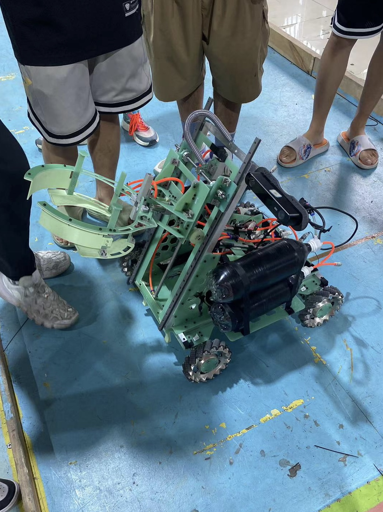

# README

一个待完工的嵌入式Ai项目。

在这个暑假里学习了不少STM32开发的内容，并参加了电子科技大学LIMIT战队的RobotCon夏令营，我负责电控。

 整个项目是制作一个小车，需要利用视觉与陀螺仪定位来实现小车的取环、放环功能。

- 整个小车的电路板都由电路自行绘制
- wifi模块遥控控制小车

- 涉及到由PID和陀螺仪控制的四个6020电机负责移动
- 取环放环功能
- 视觉识别环和柱子

### 与AI的结合

> 未完工

想搞那种边缘计算的感觉。

将机器学习与多电机控制的PID算法结合可以实现更智能和自适应的控制系统，从而提高多电机系统的性能和稳定性。

*预计想要实现：*

1. **参数调整和优化：** 使用机器学习算法来优化PID控制器的参数。传统的PID调参可能需要经验和多次试错，而机器学习可以通过对系统进行建模和优化，自动调整PID参数以实现更好的性能。
2. **自适应控制：** 机器学习可以监测和预测多电机系统的工作状态，并根据实时数据调整PID参数，以适应系统的变化。这种方法可以提高控制系统的适应性和鲁棒性。
3. **非线性系统控制：** 多电机系统可能包含复杂的非线性特性。机器学习技术，如神经网络，可以用来近似这些非线性关系，并根据实际情况调整PID参数，以更好地控制系统。
4. **故障检测与容错：** 机器学习可以用于监测系统的健康状态，识别潜在的故障或异常，并采取适当的措施来保证系统的正常运行。PID控制器可以根据机器学习算法提供的信息调整控制策略，以实现容错控制。

还在思考与视觉定位的结合方案。
