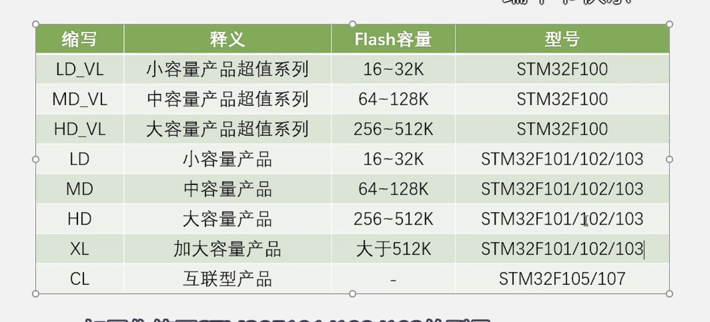
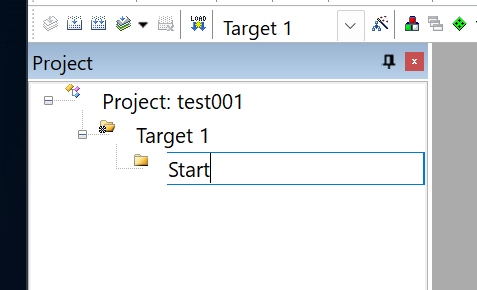
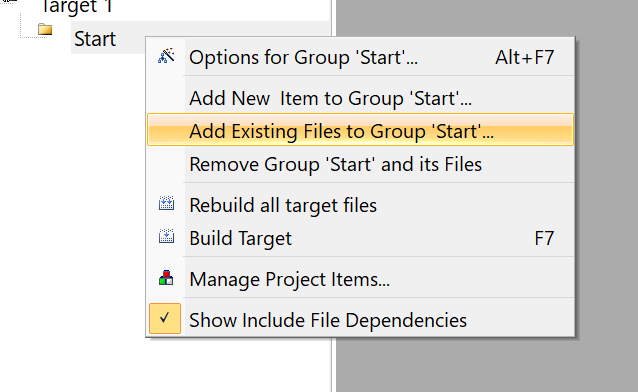
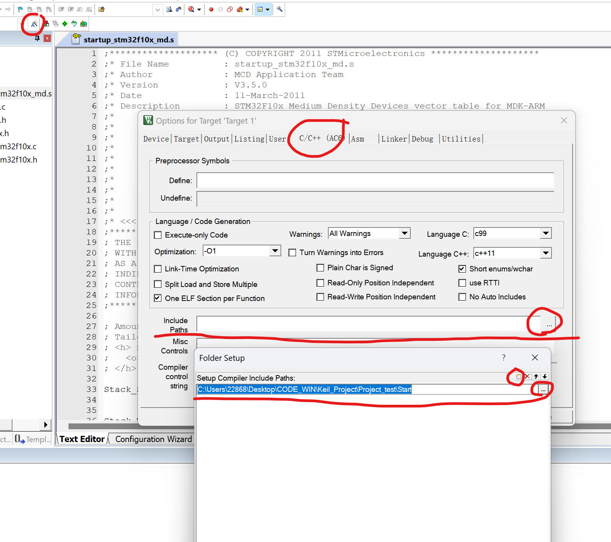
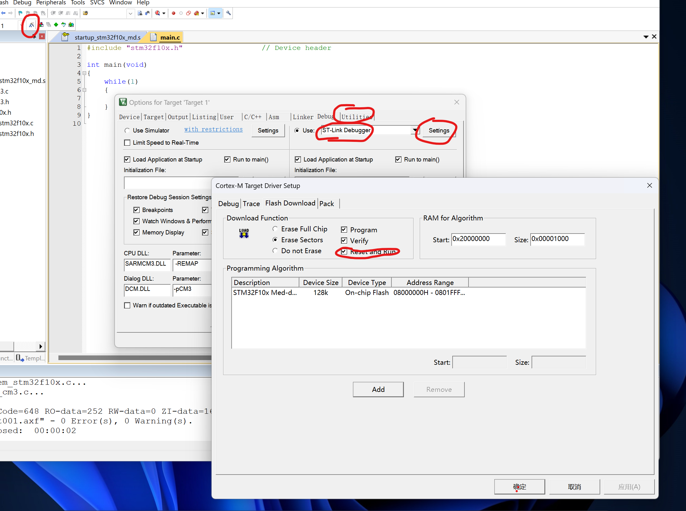
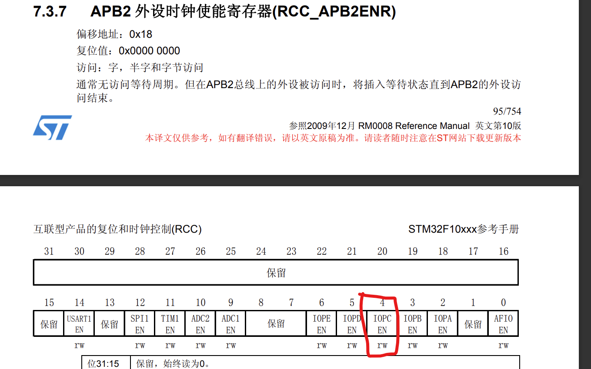
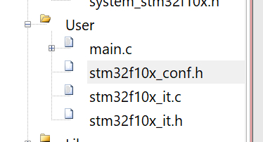
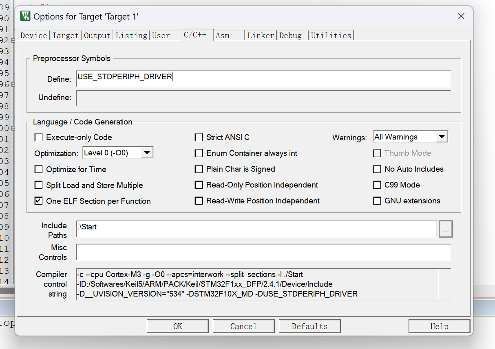
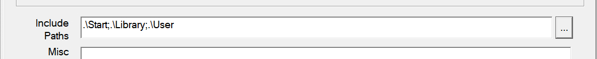
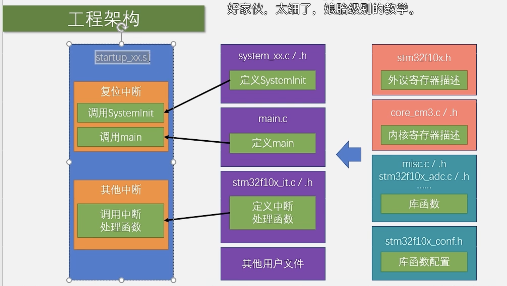

## 新建工程

- 目前开发STM32的方式主要有

  - 基于寄存器的方式

    > 类似于51单片机，是用程序直接配置寄存器来达到想要的功能

  - 基于标准库的方式

    > 通过ST官方的库函数来间接的配置寄存器

  - 基于HAL库的方式

    > 使用图形界面快速配置 

### 建立一个工程

- 新建一个文件夹

- 打开 keil 5

- 选择Project-New Project

- 选择刚刚的文件夹，再新建一个文件夹，再为工程文件起一个名字

- 为工程添加必要的文件

  - STM32的启动文件

    > STM32入门教程资料\固件库\STM32F10x_StdPeriph_Lib_V3.5.0\STM32F10x_StdPeriph_Lib_V3.5.0\Libraries\CMSIS\CM3\DeviceSupport\ST\STM32F10x\startup\arm
    >
    > 

  - 将这些文件全部复制下来，回到工程模版文件夹里新建一个文件夹，粘贴进去

  - 回到STM32F0x文件夹，有两个system开头的文件
  
    > stm32f10x.h 是外设寄存器的描述文件
    >
    > 后两个sysytem开头的是用来配置时钟的

  - 由于STM32是内核和内核外围的设备组成的，所以还需要在添加内核寄存器的描述文件

    > STM32入门教程资料\固件库\STM32F10x_StdPeriph_Lib_V3.5.0\STM32F10x_StdPeriph_Lib_V3.5.0\Libraries\CMSIS\CM3\CoreSupport

  - 回到keil软件，将复制的文件都粘贴到工程中去

    - 改名：

      

    - 右键，选择

      
  
      - 文件过滤器选择All Files
        - 添加启动文件：`.s` 文件（只能从中选一个）
        - 将其与所有的 `.c` 和 `.h` 文件添加进来
      - 添加头文件路径
        - 

 

### 编写 `main.c`

- 先在文件夹中新建一个`User`文件夹

- 再在Target1下新建Group，命名为User

- 添加`main.c`

- 编译（F7）

  > 头文件报错的话，点击魔法棒，terget->ARM Compiler 选择 V5.06

- 如果想用寄存器开发STM32，那么工程建到这里就结束了。

### 配置调试器



### 将程序加载到板子上

- 点击


## 点亮板子上的灯

### 直接操作寄存器



- 根据说明，这一位是控制GPIOC时钟的。

  - 写1即可打开时钟

  - 因此此处寄存器应该写为 00000010（十六进制）


……

最终结果：

``` c
#include "stm32f10x.h"                  // Device header

int main(void)
{
	RCC->APB2ENR = 0x00000010;
	GPIOC->CRH =   0x00300000;
	GPIOC->ODR =   0x00000000;
	while(1)
	{
		
	}
}

```


### 使用库函数

#### 导入库函数

将 `固件库\STM32F10x_StdPeriph_Lib_V3.5.0\STM32F10x_StdPeriph_Lib_V3.5.0\Libraries\STM32F10x_StdPeriph_Driver`文件夹下两个文件夹中的内容都粘贴到工程文件夹中（新建一个Library文件夹存放）。随后在Keil5中建一个同名的New Group

#### 导入三个文件



#### 宏定义

- 在`main.c`右键点击头文件`stm32f10.h`，最下面八千二百行的位置找到

  ``` c
  #ifdef USE_STDPERIPH_DRIVER
    #include "stm32f10x_conf.h"
  #endif
  ```

  随后

  

  再添加include paths

  

  

## 工程架构

