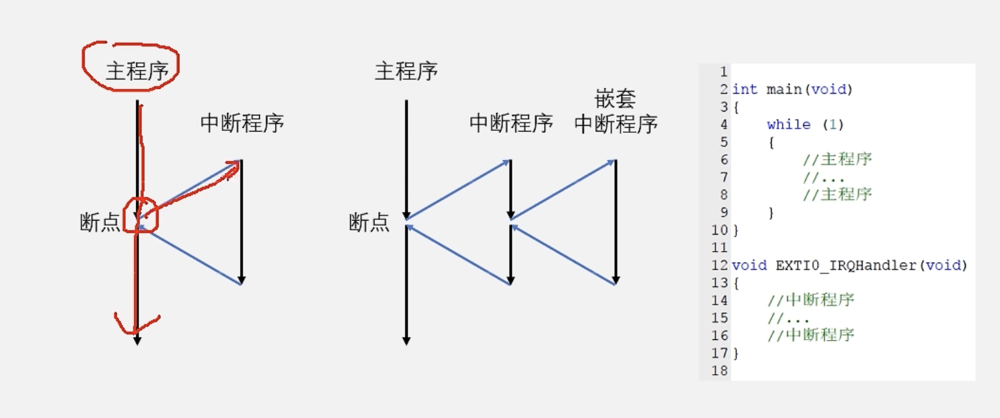
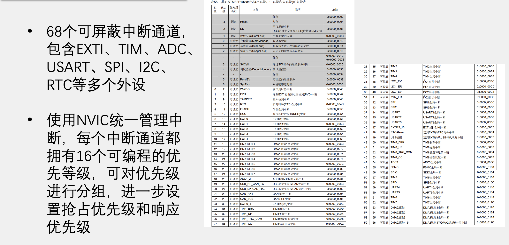
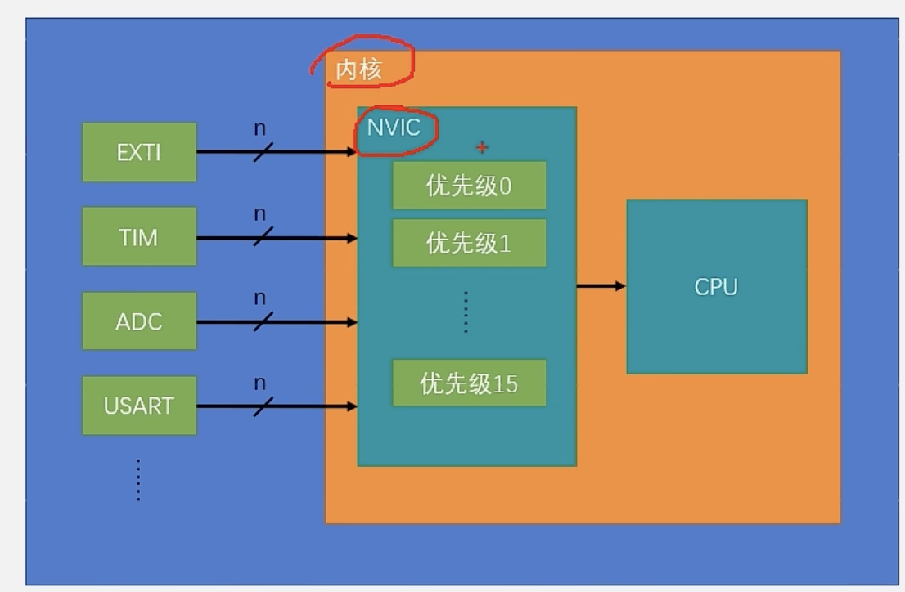
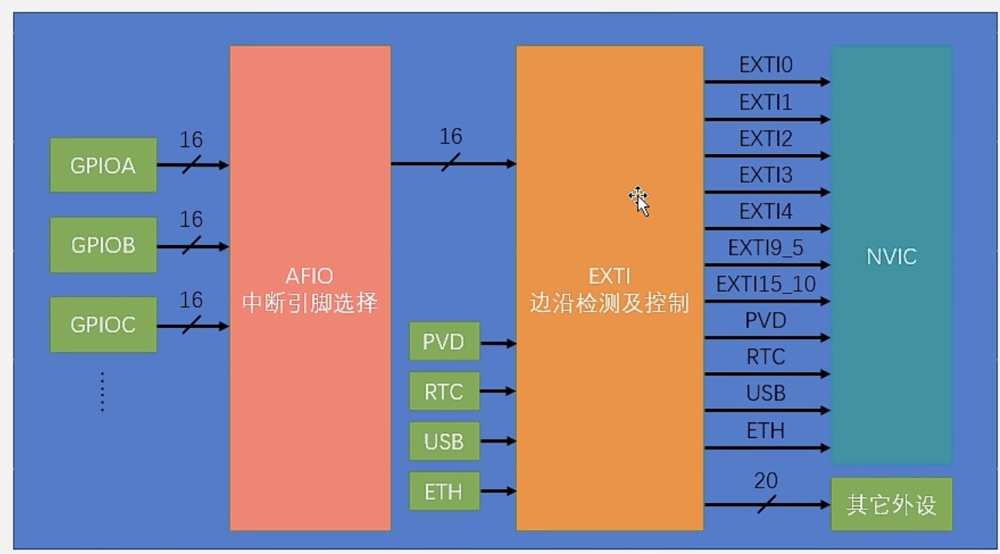
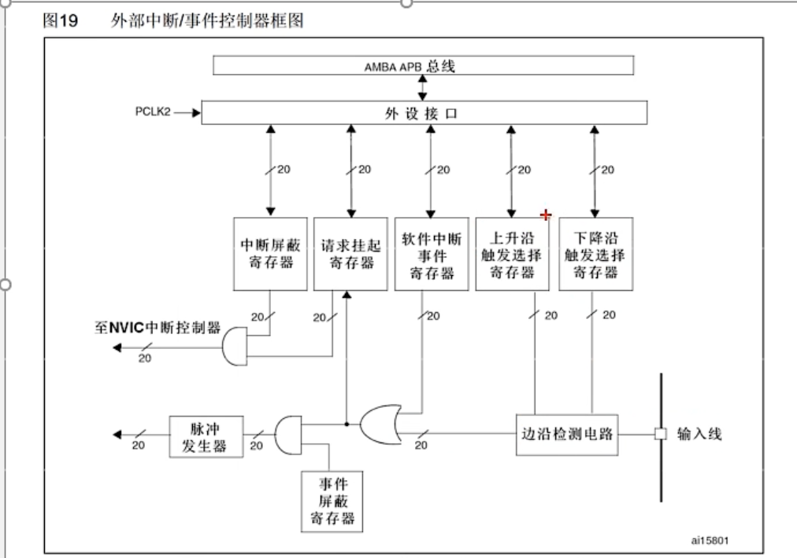
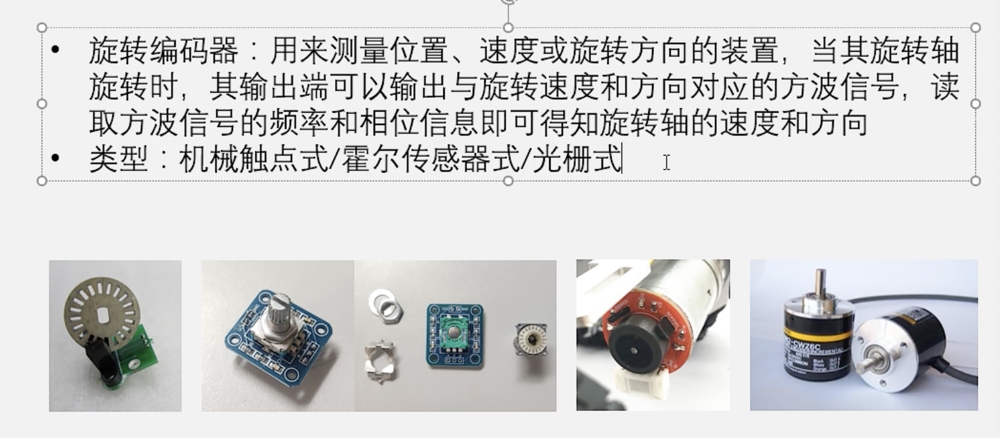
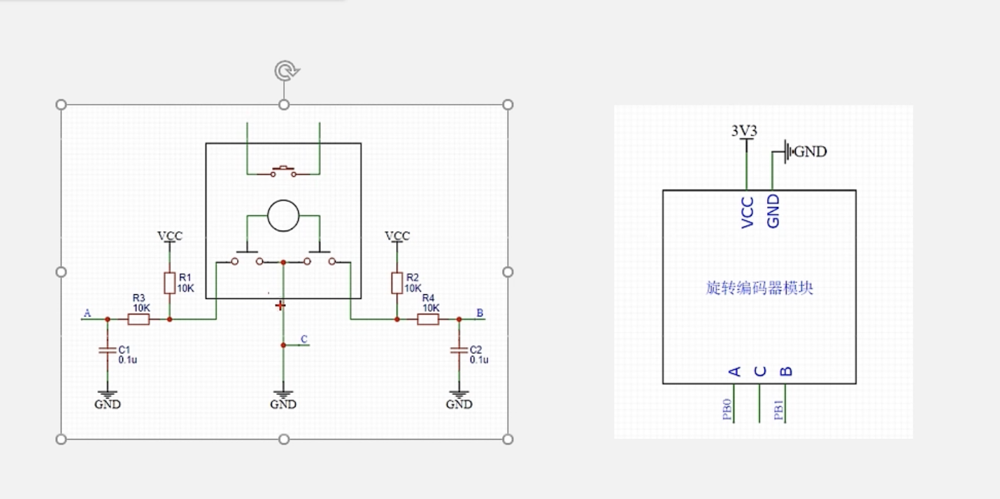

# 4.0 EXTI外部中斷

## 中斷系統

>  中斷系統是管理和執行中斷的邏輯結構，外部中斷是眾多能產生中斷的外設之一。

- #### 中斷

  - 在主程序運行過程中出現了特定的中斷觸發條件（中斷源），使得CPU暫停當前正在運行的程序，轉而去處理中斷程序，處理完成後又返回原來被暫停的位置繼續運行。

    > 比如對於外部中斷來說，可以時引腳發生了電平跳變，對於定時器來說可以是定時的時間到了，對於串口通信來說可以是接受到了數據

- #### 中斷優先級

  - 當有多個中斷元同時申請中斷時，CPU會根據中斷源的輕重緩急來逕行裁決。優先響應更加緊急的中斷源

- #### 中斷嵌套

  - 當一個中斷程序正在運行時，又有新的更高優先級的中斷源申請中斷，CPU再次暫停當前中斷程序，轉而去處理新的中斷程序，處理完成後依次進行返回。



## STM32 中斷



> 灰色部分為內核中斷
>
> - 地址——硬件限制，中斷只能跳轉到固定位置。但是中斷時需要執行的函數的地址是由編譯器，並不固定。此時需要一個“中斷向量表”來負責跳轉。

## NVIC

- 一個內核外設，是CPU的小助手。NVIC有很多輸入口，經過每個中斷的優先級分配中斷的先後順序，之後僅通過一根連線通知CPU需要何時中斷，提高效率。



- #### 中斷優先級由寄存器的4位（0～15）決定。

  - 這四位可以進行切分，分為高n位的槍戰優先級和低4-n位的響應優先級

  - 搶佔優先級高的可以中斷嵌套，响應優先級高的優先排隊

  - 搶佔優先級和响應優先級相同時，按照上表中的中斷號排隊

    > STM32中不存在先來後到，它只在乎誰更重要。

- #### 五種分組方式：

  

  - 在編寫代碼過程中，自行選擇不同位數佔比的搶佔/响應優先級

- #### 相關庫函數（`misc.h`)

  ``` c
  //配置中斷分組。整個芯片在一次執行中只能由一種分組。
  void NVIC_PriorityGroupConfig(uint32_t NVIC_PriorityGroup);
  //根據結構體裡面指定的參數初始化NVIC
  void NVIC_Init(NVIC_InitTypeDef* NVIC_InitStruct);
  //設置中斷向量表
  void NVIC_SetVectorTable(uint32_t NVIC_VectTab, uint32_t Offset);
  //系統低功耗配置
  void NVIC_SystemLPConfig(uint8_t LowPowerMode, FunctionalState NewState);
  ```

  

## EXT~ern~I~nterrupt~  外部中斷

- #### 可以檢測指定GPIO口的電平信號

  - 當其指定的GPIO口產生電平變化時，EXTI將立即向NVIC發出中斷申請，經過NVIC裁決後即可中斷CPU主程序

- #### 觸發方式

  - 上升沿：從低電平到高電平的瞬間觸發中斷
  - 下降沿：從高到低
  - 雙邊沿：上升下降都行
  - 軟件觸發：在代碼中直接中斷，不管硬件電路

- #### 支持所有GPIO口

  - 數字編號相同的GPIOX_Pin不能同時觸發中斷

- #### 20個通道數

  - 16個GPIO_Pin
  - PVD輸出
  - RTC鬧鐘
  - USB喚醒
  - 乙太網喚醒

  > 後四個其實只是來蹭EXTI。因為EXTI能從低功耗的停止模式下喚醒STM32

- #### 觸發响應方式

  - 中斷响應
  - 事件响應
    - 本來是該觸發中斷的，但是STM32能讓它不觸發中斷而觸發一個事件——例如觸發別的外設進行合作

- #### 基本結構

  

  

- #### 相關庫函數

  ``` c
  //重設EXTI配置，恢復到剛上電的默認狀態
  void EXTI_DeInit(void);
  //根據結構體裡的參數配置EXTI外設
  void EXTI_Init(EXTI_InitTypeDef* EXTI_InitStruct);
  //將參數傳遞的結構體變量賦一個默認值
  void EXTI_StructInit(EXTI_InitTypeDef* EXTI_InitStruct);
  //軟件觸發外部中斷
  void EXTI_GenerateSWInterrupt(uint32_t EXTI_Line);
  //當中斷信號來臨時，會有一個掛起寄存器放置一個標誌位。下面兩個函數適用於主程序
  //該函數用於獲取指定的標誌位是否被置1了
  FlagStatus EXTI_GetFlagStatus(uint32_t EXTI_Line);
  //對置1的標誌位進行清除
  void EXTI_ClearFlag(uint32_t EXTI_Line);
  //對於這戲標誌位，有的比較緊急，在置標誌位後會觸發中斷。下面兩個函數適用於中斷程序 
  //獲取中斷標誌位是否被置1了
  ITStatus EXTI_GetITStatus(uint32_t EXTI_Line);
  //清除掛起中斷標誌位
  void EXTI_ClearITPendingBit(uint32_t EXTI_Line);
  ```

### AFIO復用IO口

- AFIO主要用於引腳服用功能的選擇和重定義
- 在STM32中，AFIO主要完成兩個任務：復用功能引腳重映射、中斷引腳選擇

#### 相關庫函數

``` c
//復位AFIO外設
void GPIO_AFIODEInit(void);
//鎖定GPIO配置
void GPIO_PinLockConfig(GPIO_TypeDef* GPIOx, uint16_t GPIO_Pin);
//配置AFIO之事件輸出功能
void GPIO_EventOutputConfig(uint8_t GPIO_PortSource, uint8_t GPIO_PinSource);
void GPIO_EventOutputCmd(FunctionalState NewState);
//進行引腳重映射
void GPIO_PinRemapConfig(uint32_t GPIO_Remap, FunctionalState NewState);
//配置外部中斷。配置AFIO的數據選擇器，來選擇我們想要的中斷引腳
void GPIO_EXTILineConfig(uint8_t GPIO_PortSource, uint8_t GPIO_PinSource);
//配置乙太網外設
void GPIO_ETH_MediaInterfaceConfig(uint32_t GPIO_ETH_MediaInterface);
```

### 需求EXTI的外設

- 旋轉編碼器、紅外遙控接收頭⋯⋯

- #### 使用EXTI的外部中斷模塊的特性

  - 想要獲取的信號是外部驅動的很快的突發信號
    - 比如旋轉編碼器的輸出信號。
      - 我們可能很久都不會寧它，這時不需要STM32做任何事。
      - 同時它是外部驅動的，STM32只能被動讀取。
      - 並且這個信號相當快，如果STM32稍晚一點來讀取就會錯過很多波形。
  - 並不推薦使用外部中斷來讀取按鍵


## 旋轉編碼器





## 代碼實踐

### 初始化

> 五個外設！

- #### 配置RCC，打開時鐘

  - 四個外設，應當打開四個時鐘。

  ``` c
  RCC_APB2PeriphClockCmd(RCC_APB2Periph_GPIOB, ENABLE);
  RCC_APB2PeriphClockCmd(RCC_APB2Periph_AFIO, ENABLE);
  //NVIC的時鐘是默認自動打開的
  //EXTI模塊的寄存器裡沒有時鐘控制位，它借助Sysclk的時鐘
  ```

  - 注意GPIOB和AFIO連結的都是APB2總線！！！
  - 不知道的話隨便敲一個，再轉到該函數定義處查看註釋。

- #### 配置GPIO，為輸入模式

  - 不知道這個外設該配置什麼輸入模式就去查手冊。手冊中對於EXTI輸入線的外部中斷輸入功能推薦的配置是浮空、上拉和下拉

  ``` c
  	GPIO_InitTypeDef GPIO_InitStructure;
  	GPIO_InitStructure.GPIO_Mode = GPIO_Mode_IPU;
  	GPIO_InitStructure.GPIO_Pin = GPIO_Pin_14;
  	GPIO_InitStructure.GPIO_Speed = GPIO_Speed_50MHz;
  	GPIO_Init(GPIOB, &GPIO_InitStructure);
  ```

- #### 配置AFIO，選擇所用的GPIO將其連結到後面的EXTI

  - AFIO並沒有單獨的庫函數。它們被集成到了GPIO庫函數中。

  ``` c
  GPIO_EXTILineConfig(GPIO_PortSourceGPIOB, GPIO_PinSource14);
  ```

- #### 配置EXTI，選擇邊沿觸發方式和觸發响應方式

  - EXTI只有一個，所以不需要想GPIO要指定是哪一個GPIO了

  ``` c
  //初始化結構體變量
  EXTI_InitTypeDef EXTI_InitStructure;
  //Specifies the EXTI lines(從AFIO輸入EXTI的線路)
  EXTI_InitStructure.EXTI_Line = EXTI_Line14;
  //To be ENABLE or DISABLE
  EXTI_InitStructure.EXTI_LineCmd = ENABLE;
  //選擇中斷模式或事件模式
  EXTI_InitStructure.EXTI_Mode = EXTI_Mode_Interrupt;
  //EXTI的觸發邊沿模式
  EXTI_InitStructure.EXTI_Trigger = EXTI_Trigger_Falling;
  //調用初始化函數
  EXTI_Init(&EXTI_InitStructure);
  ```

- #### 配置NVIC，為此中斷選擇恰當的優先級

  ``` c
  //配置分組模式
  NVIC_PriorityGroupConfig(NVIC_PriorityGroup_2);
  //初始化結構體變量
  NVIC_InitTypeDef NVIC_InitStructure;
  //指定中斷通道(輸入NVIC的那條線路)
  NVIC_InitStructure.NVIC_IRQChannel = EXTI15_10_IRQn;
  //開啟還是關閉
  NVIC_InitStructure.NVIC_IRQChannelCmd = ENABLE;
  //指定搶佔優先級
  NVIC_InitStructure.NVIC_IRQChannelPreemptionPriority = 1;
  //指定响應優先級
  NVIC_InitStructure.NVIC_IRQChannelSubPriority = 1;
  NVIC_Init(&NVIC_InitStructure);
  ```

### 書寫中斷函數

> 在主程序運行時，遇到了中斷信號就需要條轉到中斷程序。這時候就需要我們書寫一個中斷函數了。在STM32中，中斷函數的名字都是固定的。每個中斷通道對一個中斷函數。

- #### 找到對應的中斷函數名

  - 打開啟動文件（此工程位MD）
  - 找到中斷向量表
  - 以 IRQHandler 結尾的字符串就是中斷函數的名字

- #### 編寫中斷函數

  - 接著剛剛初始化的下面寫。中斷函數都是無參數無返回值的！

    ``` c
    void EXTI15_10_IRQHandler(void)
    ```

  - 進行中斷標誌位的判斷，**並在`if`的最後將標誌位置0！**

    ``` c
    if(EXTI_GetStatus(EXTI_Line14)== SET)
    {
      ...
        
      EXTI_ClearITPendingBit(EXTI_Line14);
    }
    ```

> 中斷函數不用聲明。中斷函數不需要調用，它是自動執行的。初始化完成後，NVIC將自動開啟對所設置引腳的檢測，並將中斷情況上報給CPU，不需要在`main.c`中調用函數。

- #### 編譯該文件

  - 不然在`main`中可能顯示不出來我們新寫的函數。

### 測試能否正常觸發

- 在中斷函數打上斷點，進入Keil調適模式。


## 中斷編程注意事項

- #### 中斷函數的執行速度一定要很快

- #### 不能在中斷函數和主函數調用相同的函數或者操作同一個硬件！

  - 減少代碼之間的耦合性，讓個部分代碼相互獨立！
  - 僅使用變量、標誌位或者函數作為接口
