# TIM定時器

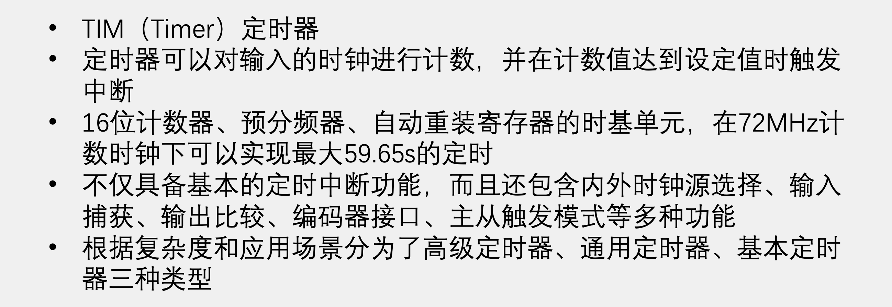

## 定時器類型

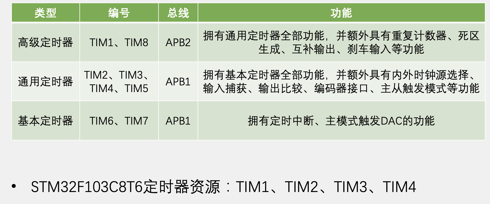

## TIM的部分基本函數

``` c
//恢復默認配置
void TIM_DeInit(TIM_TypeDef* TIMx);

//重要！ 用於配置時基單元
void TIM_TimeBaseInit(TIM_TypeDef* TIMx, TIM_TimeBaseInitTypeDef* TIM_TimeBaseInitStruct);

//四个OutputCompare输出比较初始化函数。一个通用定时器有四个输出比较模块，也就对应了这里的四个函数
//第一个参数用于选择对应计时器TIM_X
//第二个结构体就是输出比较的一系列参数
//*一般而言，结构体初始化好后，都会有一个单独的函数可以进行修改*
void TIM_OC1Init(TIM_TypeDef* TIMx, TIM_OCInitTypeDef* TIM_OCInitStruct);
void TIM_OC2Init(TIM_TypeDef* TIMx, TIM_OCInitTypeDef* TIM_OCInitStruct);
void TIM_OC3Init(TIM_TypeDef* TIMx, TIM_OCInitTypeDef* TIM_OCInitStruct);
void TIM_OC4Init(TIM_TypeDef* TIMx, TIM_OCInitTypeDef* TIM_OCInitStruct);

//一个InputCapture输入捕获初始化函数。IC虽有4个通路，但是却共有一个函数——在结构体里选择配置哪个通道。这么设计的原因是IC可能涉及到交叉通道的配置。
void TIM_ICInit(TIM_TypeDef* TIMx, TIM_ICInitTypeDef* TIM_ICInitStruct);

//一个InputCapture_PWNMI_mode输入捕获PWMI模式初始化函数。快速配置两个通道用于PWMI模式。
void TIM_PWMIConfig(TIM_TypeDef* TIMx, TIM_ICInitTypeDef* TIM_ICInitStruct);

void TIM_BDTRConfig(TIM_TypeDef* TIMx, TIM_BDTRInitTypeDef *TIM_BDTRInitStruct);
//給結構體變量賦一個默認值
void TIM_TimeBaseStructInit(TIM_TimeBaseInitTypeDef* TIM_TimeBaseInitStruct);

//给输出比较结构体赋默认值
void TIM_OCStructInit(TIM_OCInitTypeDef* TIM_OCInitStruct);

//给输入捕获结构体赋默认值
void TIM_ICStructInit(TIM_ICInitTypeDef* TIM_ICInitStruct);
void TIM_BDTRStructInit(TIM_BDTRInitTypeDef* TIM_BDTRInitStruct);
//用於始能計數器（對應上圖的“運行控制”）
void TIM_Cmd(TIM_TypeDef* TIMx, FunctionalState NewState);

//*仅高级定时器使用* 在使用高级定时器输出PWM时需要调用这个函数，使能主输出，否则PWM将不能正常输出
void TIM_CtrlPWMOutputs(TIM_TypeDef* TIMx, FunctionalState NewState);
//始能中斷輸出信號（對應上圖中的“中斷輸出控制”）
void TIM_ITConfig(TIM_TypeDef* TIMx, uint16_t TIM_IT, FunctionalState NewState);

void TIM_GenerateEvent(TIM_TypeDef* TIMx, uint16_t TIM_EventSource);
void TIM_DMAConfig(TIM_TypeDef* TIMx, uint16_t TIM_DMABase, uint16_t TIM_DMABurstLength);
void TIM_DMACmd(TIM_TypeDef* TIMx, uint16_t TIM_DMASource, FunctionalState NewState);
/* 選擇時鐘部分：RCC內部時鐘、ETR外部時鐘、ITRx其他定時器、TIx捕獲通道 */
//選擇內部時鐘
void TIM_InternalClockConfig(TIM_TypeDef* TIMx);
//選擇ITRx其他計時器
void TIM_ITRxExternalClockConfig(TIM_TypeDef* TIMx, uint16_t TIM_InputTriggerSource);
//選擇TIx捕獲通道的時鐘
void TIM_TIxExternalClockConfig(TIM_TypeDef* TIMx, uint16_t TIM_TIxExternalCLKSource,uint16_t TIM_ICPolarity, uint16_t ICFilter);
/* 對於ETR輸入的外部時鐘而言，這兩個函數是等效的。如果不需要觸發輸入的功能，這兩個函數可以互換 */
//選擇ETR通過外部時鐘模式1輸入的時鐘
void TIM_ETRClockMode1Config(TIM_TypeDef* TIMx, uint16_t TIM_ExtTRGPrescaler, uint16_t TIM_ExtTRGPolarity,uint16_t ExtTRGFilter);
//選擇ETR通過外部時鐘模式2輸入的時鐘
void TIM_ETRClockMode2Config(TIM_TypeDef* TIMx, uint16_t TIM_ExtTRGPrescaler, 
                             uint16_t TIM_ExtTRGPolarity, uint16_t ExtTRGFilter);
//單獨用來配置ETR引腳的預分頻器、極性、濾波器這些參數的
void TIM_ETRConfig(TIM_TypeDef* TIMx, uint16_t TIM_ExtTRGPrescaler, uint16_t TIM_ExtTRGPolarity,
                   uint16_t ExtTRGFilter);
//單獨一個函數用於很方便的修改預分頻率值
void TIM_PrescalerConfig(TIM_TypeDef* TIMx, uint16_t Prescaler, uint16_t TIM_PSCReloadMode);
//用於改變計數器的計數模式
void TIM_CounterModeConfig(TIM_TypeDef* TIMx, uint16_t TIM_CounterMode);

//选择输入出发源TRGI（从模式中的内容）
void TIM_SelectInputTrigger(TIM_TypeDef* TIMx, uint16_t TIM_InputTriggerSource);

//定时器编码器接口配置
//第一个参数选择TIM定时器
//第二个参数选择编码器模式
//后面两个参数，分别选择通道1和通道2的电平极性
void TIM_EncoderInterfaceConfig(TIM_TypeDef* TIMx, uint16_t TIM_EncoderMode,
                                uint16_t TIM_IC1Polarity, uint16_t TIM_IC2Polarity);

//四个用于配置强制输出模式。如果在运行中想要暂停输出波形并且强制输出高或低电平就使用这个函数
void TIM_ForcedOC1Config(TIM_TypeDef* TIMx, uint16_t TIM_ForcedAction);
void TIM_ForcedOC2Config(TIM_TypeDef* TIMx, uint16_t TIM_ForcedAction);
void TIM_ForcedOC3Config(TIM_TypeDef* TIMx, uint16_t TIM_ForcedAction);
void TIM_ForcedOC4Config(TIM_TypeDef* TIMx, uint16_t TIM_ForcedAction);

//自動重裝器預裝功能配置，選擇是否開啟自動重裝
void TIM_ARRPreloadConfig(TIM_TypeDef* TIMx, FunctionalState NewState);
void TIM_SelectCOM(TIM_TypeDef* TIMx, FunctionalState NewState);
void TIM_SelectCCDMA(TIM_TypeDef* TIMx, FunctionalState NewState);
void TIM_CCPreloadControl(TIM_TypeDef* TIMx, FunctionalState NewState);

//四个用于配置CCR寄存器的预装功能的函数。你写入的值不会立即生效，而是在更新事件才会生效
void TIM_OC1PreloadConfig(TIM_TypeDef* TIMx, uint16_t TIM_OCPreload);
void TIM_OC2PreloadConfig(TIM_TypeDef* TIMx, uint16_t TIM_OCPreload);
void TIM_OC3PreloadConfig(TIM_TypeDef* TIMx, uint16_t TIM_OCPreload);
void TIM_OC4PreloadConfig(TIM_TypeDef* TIMx, uint16_t TIM_OCPreload);

//四个用于配置快速使能的函数
void TIM_OC1FastConfig(TIM_TypeDef* TIMx, uint16_t TIM_OCFast);
void TIM_OC2FastConfig(TIM_TypeDef* TIMx, uint16_t TIM_OCFast);
void TIM_OC3FastConfig(TIM_TypeDef* TIMx, uint16_t TIM_OCFast);
void TIM_OC4FastConfig(TIM_TypeDef* TIMx, uint16_t TIM_OCFast);

//四个外部事件时清除REF信号的函数
void TIM_ClearOC1Ref(TIM_TypeDef* TIMx, uint16_t TIM_OCClear);
void TIM_ClearOC2Ref(TIM_TypeDef* TIMx, uint16_t TIM_OCClear);
void TIM_ClearOC3Ref(TIM_TypeDef* TIMx, uint16_t TIM_OCClear);
void TIM_ClearOC4Ref(TIM_TypeDef* TIMx, uint16_t TIM_OCClear);

//单独用来配置输出比较的极性。带有N的是高级输出比较通道的互补输出通道
void TIM_OC1PolarityConfig(TIM_TypeDef* TIMx, uint16_t TIM_OCPolarity);
void TIM_OC1NPolarityConfig(TIM_TypeDef* TIMx, uint16_t TIM_OCNPolarity);
void TIM_OC2PolarityConfig(TIM_TypeDef* TIMx, uint16_t TIM_OCPolarity);
void TIM_OC2NPolarityConfig(TIM_TypeDef* TIMx, uint16_t TIM_OCNPolarity);
void TIM_OC3PolarityConfig(TIM_TypeDef* TIMx, uint16_t TIM_OCPolarity);
void TIM_OC3NPolarityConfig(TIM_TypeDef* TIMx, uint16_t TIM_OCNPolarity);
void TIM_OC4PolarityConfig(TIM_TypeDef* TIMx, uint16_t TIM_OCPolarity);

//单独用来修改输出使能参数的
void TIM_CCxCmd(TIM_TypeDef* TIMx, uint16_t TIM_Channel, uint16_t TIM_CCx);
//单独用来更难改输出比较模式的函数
void TIM_CCxNCmd(TIM_TypeDef* TIMx, uint16_t TIM_Channel, uint16_t TIM_CCxN);
void TIM_SelectOCxM(TIM_TypeDef* TIMx, uint16_t TIM_Channel, uint16_t TIM_OCMode);
void TIM_UpdateDisableConfig(TIM_TypeDef* TIMx, FunctionalState NewState);
void TIM_UpdateRequestConfig(TIM_TypeDef* TIMx, uint16_t TIM_UpdateSource);
void TIM_SelectHallSensor(TIM_TypeDef* TIMx, FunctionalState NewState);
void TIM_SelectOnePulseMode(TIM_TypeDef* TIMx, uint16_t TIM_OPMode);

//选择输出触发源TRGO（主模式的内容）
void TIM_SelectOutputTrigger(TIM_TypeDef* TIMx, uint16_t TIM_TRGOSource);

//选择从模式
void TIM_SelectSlaveMode(TIM_TypeDef* TIMx, uint16_t TIM_SlaveMode);
void TIM_SelectMasterSlaveMode(TIM_TypeDef* TIMx, uint16_t TIM_MasterSlaveMode);
//給計數器手動寫入一個值
void TIM_SetCounter(TIM_TypeDef* TIMx, uint16_t Counter);

//給自動重轉器寫入一個值
void TIM_SetAutoreload(TIM_TypeDef* TIMx, uint16_t Autoreload);

//四个单独用来更改CCR寄存器值的函数。比较重要，经常用来修改占空比
void TIM_SetCompare1(TIM_TypeDef* TIMx, uint16_t Compare1);
void TIM_SetCompare2(TIM_TypeDef* TIMx, uint16_t Compare2);
void TIM_SetCompare3(TIM_TypeDef* TIMx, uint16_t Compare3);
void TIM_SetCompare4(TIM_TypeDef* TIMx, uint16_t Compare4);

//用于分别单独配置CH1、2、3、4的分频器
void TIM_SetIC1Prescaler(TIM_TypeDef* TIMx, uint16_t TIM_ICPSC);
void TIM_SetIC2Prescaler(TIM_TypeDef* TIMx, uint16_t TIM_ICPSC);
void TIM_SetIC3Prescaler(TIM_TypeDef* TIMx, uint16_t TIM_ICPSC);
void TIM_SetIC4Prescaler(TIM_TypeDef* TIMx, uint16_t TIM_ICPSC);
void TIM_SetClockDivision(TIM_TypeDef* TIMx, uint16_t TIM_CKD);

//分别读取4个通道的CCR。这四个函数与上方的更改CCR一一对应
uint16_t TIM_GetCapture1(TIM_TypeDef* TIMx);
uint16_t TIM_GetCapture2(TIM_TypeDef* TIMx);
uint16_t TIM_GetCapture3(TIM_TypeDef* TIMx);
uint16_t TIM_GetCapture4(TIM_TypeDef* TIMx);
//獲取當前計數器的值，用於查看當前計數器計到哪裡了
uint16_t TIM_GetCounter(TIM_TypeDef* TIMx);
//獲取當前的預分頻器的值
uint16_t TIM_GetPrescaler(TIM_TypeDef* TIMx);
//用於獲取/清除標誌位
FlagStatus TIM_GetFlagStatus(TIM_TypeDef* TIMx, uint16_t TIM_FLAG);
void TIM_ClearFlag(TIM_TypeDef* TIMx, uint16_t TIM_FLAG);
ITStatus TIM_GetITStatus(TIM_TypeDef* TIMx, uint16_t TIM_IT);
void TIM_ClearITPendingBit(TIM_TypeDef* TIMx, uint16_t TIM_IT);

```

## 定時中斷

### 基本結構

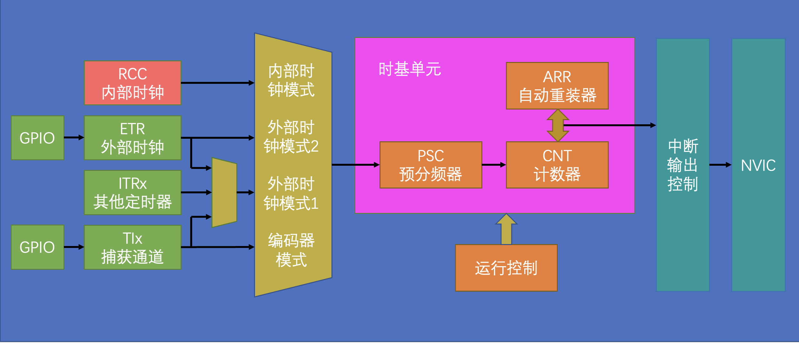

### 配置時鐘

- #### 開啟TIM2外設時鐘

  - 注意是開啟`APB1` ：`TIM2` 是`APB1` 上的外設。

    ``` c
    RCC_APB1PeriphClockCmd(RCC_APB1Periph_TIM2, ENABLE);
    ```

    

- #### 選擇時基單元的時鐘

  - 我們這裡想選擇內部時鐘作為時基單元的時鐘（定時器上電後默認就會使用內部時鐘）

    ``` c
    TIM_InternalClockConfig(TIM2);
    ```

- #### 配置時基單元

  - 使用函數來初始化時基單元

    ``` c
    //使用結構體初始化
    TIM_TimeBaseInitTypeDef TIM_TimeBaseInitStructure;
    //指定時鐘分頻（在定時器的輸入處都會有一個濾波器，用於過濾不穩定電流。時鐘分頻能決定採樣頻率。若採樣週期上電平一致，則代表輸入信號穩定。採樣頻率是通過內部時鐘經過時鐘分頻而來。
    TIM_TimeBaseInitStructure.TIM_ClockDivision = TIM_CKD_DIV1;
    //計數器模式。向上、下以及三種中央對齊的模式。
    TIM_TimeBaseInitStructure.TIM_CounterMode = TIM_CounterMode_Up;
    //決定計時間隔的關鍵參數⬇️
    //對72MHZ分頻7200，計數10000次，剛好一秒。注意代碼中這兩個值是從0開始數數，所以要減1
    //1️⃣計數週期，即ARR自動重裝器的值。
    TIM_TimeBaseInitStructure.TIM_Period = 10000 - 1;
    //2️⃣PSC預分頻器的值
    TIM_TimeBaseInitStructure.TIM_Prescaler = 7200 - 1;
    //
    //重複計數器的值，用於設置在定時器溢出之前需要重複多少次。（僅高級定時器才有，其餘設置為0）
    TIM_TimeBaseInitStructure.TIM_RepetitionCounter = 0;
    //調用TimeBaseInit函數
    TIM_TimeBaseInit(TIM2, &TIM_TimeBaseInitStructure);
    ```

- #### 始能更新中斷

  - 對應上圖中斷輸出控制

    - 可以從Update、系列Compare、Trigger和Break中選擇

    ``` c
    TIM_ITConfig(TIM2, TIM_IT_Update, ENABLE);
    ```

    ​		這樣就開啟了更新中斷到NVIC的通路

- #### 配置NVIC

  - NVIC優先級分組

    ``` c
    NVIC_PriorityGroupConfig(NVIC_PriorityGroup_2);
    ```

  - 初始化结构体

    ``` c
    NVIC_InitTypeDef NVIC_InitStructure;
    NVIC_InitStructure.NVIC_IRQChannel = TIM2_IRQn;
    NVIC_InitStructure.NVIC_IRQChannelCmd = ENABLE;
    NVIC_InitStructure.NVIC_IRQChannelPreemptionPriority = 2;
    NVIC_InitStructure.NVIC_IRQChannelSubPriority = 1;
    NVIC_Init(&NVIC_InitStructure);
    ```

- #### 启动定时器

  ``` c
  TIM_Cmd(TIM,ENABLE);
  ```

- #### 书写中断函数

  - 前往启动文件，选中对应的`IRQHandler`函数

  ``` c
  void TIM2_IRQHandler(void)
  {
    if(TIM_GetITStatus(TIM2,TIM_IT_Update) == SET )
    {
      
      ...
        
      TIM_ClearITPendingBit(TIM2,TIM_IT_Update);
    }
  }
  ```
  


### Bug

- #### 刚开始计数是从1开始的

  - `TIM_TimeBaseInit`函数在刚上电时就执行了一次更新事件——立刻生成一个更新事件，来重新装载预分频器和重复计数器的值。

    > 预分频器是由一个缓冲寄存器的，我们写的值只有在更新事件时才会真正起作用。所以这里为了让值立刻起作用，就在这最后手动生成了一个更新事件。但副作用是更新事件和更新中断是同事发生的，更新中断会置更新中断标识位，当我们之后一旦初始化完成，更新中断就会立刻进入。

    - ##### 解决方案：手动清除更新中断标志位

      - ##### 调用完这一行函数后在手动调用一下 `TIM_ClearFlag(TIM2,TIM_FLAG_Update)`

  - #### TIM_ClearFlag 和 TIM_ClearITPendingBit 函数有什么区别

  > `TIM_ClearFlag`和`TIM_ClearITPendingBit`函数的区别在于它们清除的标志位不同。
  >
  > 1. `TIM_ClearFlag`函数用于清除定时器相关的标志位，例如溢出标志位、比较匹配标志位等。它将会清除定时器的状态寄存器中的标志位。这个函数通常用于在处理定时器中断时清除相应的标志位，以避免多次触发中断。
  > 2. `TIM_ClearITPendingBit`函数则用于清除定时器中断相关的标志位。它将会清除定时器的中断屏蔽寄存器中的标志位，并通过软件方式清除对应的中断挂起标志位。这个函数通常用于在处理定时器中断时清除相应的中断标志位，以允许后续的中断触发。
  >
  > 总的来说，`TIM_ClearFlag`函数用于清除定时器的状态标志位，而`TIM_ClearITPendingBit`函数用于清除定时器的中断标志位。具体使用哪个函数要根据你想要清除的标志位来决定。

  - #### 那我如何确定TIM_ClearFlag函数清楚的是哪种标志位呢

  > 要确定`TIM_ClearFlag`函数清除的是哪种标志位，你需要参考使用的定时器的文档或者寄存器映射表。
  >
  > 在文档中，通常会有一个定时器状态寄存器（SR）的描述，其中列出了不同位的含义和对应的标志位。你可以查阅该文档，找到与你感兴趣的标志位相关的描述。
  >
  > 如果你使用的是寄存器映射表，你可以查看定时器的状态寄存器的位域描述。根据位域的名称和描述，你可以确定每个标志位所代表的含义。
  >
  > 一旦你确定了与你想要清除的标志位对应的标志位名称或者位域，就可以使用`TIM_ClearFlag`函数来清除相应的标志位。

  - #### 也就是说TIM_ClearITPending 函数只能清除计数器的中断标志位咯？

  > 不完全正确。 `TIM_ClearITPendingBit` 函数用于清除定时器中断的标志位，而不仅仅是计数器中断的标志位。
  >
  > 在使用定时器时，通常会启用不同类型的中断功能，如计数器溢出中断、输入捕获中断、输出比较中断等。这些不同类型的中断都有对应的标志位，用于表示中断事件是否发生。
  >
  > `TIM_ClearITPendingBit` 函数可以被用来清除任何类型的中断标志位，以确认中断已经得到处理或者需要重新启动中断。 如果要清除计数器中断的标志位，你可以像这样调用函数：`TIM_ClearITPendingBit(TIMx, TIM_IT_Update)`，其中 `TIM_IT_Update` 表示计数器溢出中断的标志位。
  >
  > 请注意，在清除中断标志位之前，必须先进行相应的中断处理，以确保不会出现重复触发中断的情况。

  - #### 那我能用TIM_ClearFlag函数清楚定时器的中断标志位吗

  > 是的，你可以使用 `TIM_ClearFlag` 函数清除定时器的中断标志位。
  >
  > `TIM_ClearFlag` 函数用于清除指定定时器的中断标志位。它接受两个参数，第一个参数是要操作的定时器的指针（例如 TIM2、TIM3 等），第二个参数是要清除的中断标志位（例如 `TIM_FLAG_Update` 表示计数器溢出中断的标志位）。
  >
  > 以下是一个示例代码片段，演示如何使用 `TIM_ClearFlag` 函数清除定时器中断标志位：
  >
  > ```
  >  // 清除定时器 TIM2 的中断标志位
  >  TIM_ClearFlag(TIM2, TIM_FLAG_Update);
  > ```
  >
  > 请注意，在调用 `TIM_ClearFlag` 函数之前必须先进行相应的中断处理，以确保不会出现重复触发中断的情况。
  >
  > 希望这能帮到你！如果有任何其他问题，请随时提问。

  - #### 那为什么还要设计TIM_ClearITPendingBit函数呢

  > `TIM_ClearITPendingBit` 函数是用于清除定时器中断挂起标志位的函数，而不仅仅是清除中断标志位。
  >
  > 在某些情况下，定时器中断可能会被触发，但是却无法正确地清除中断标志位。这可能是因为在清除中断标志位之前，中断挂起标志位已经被设置了。中断挂起标志位表示有一个中断请求正在等待处理。
  >
  > `TIM_ClearITPendingBit` 函数可以用来清除这个中断挂起标志位，以确保下一次中断能够被正确触发。此外，它还可以用于清除其他类型的中断标志位。
  >
  > 以下是一个示例代码片段，演示如何使用 `TIM_ClearITPendingBit` 函数清除定时器中断挂起标志位：
  >
  > ```
  >  // 清除定时器 TIM2 的中断挂起标志位
  >  TIM_ClearITPendingBit(TIM2, TIM_IT_Update);
  > ```
  >
  > 请注意，在调用 `TIM_ClearITPendingBit` 函数之前，你需要先进行相应的中断处理，并确认中断挂起标志位已被设置。
  >
  > 总结来说，`TIM_ClearFlag` 主要用于清除中断标志位，而 `TIM_ClearITPendingBit` 用于清除中断挂起标志位。两者的使用场景略有不同，具体使用哪个函数取决于你的需求。
  >
  > 希望这能解答你的疑问！如果还有其他问题，请随时提问。

  - #### 中断挂起标志位和中断标志位有什么区别呢

  > 中断挂起标志位和中断标志位在处理中断过程中起着不同的作用。
  >
  > - **中断挂起标志位**（Interrupt Pending Bit）表示有一个中断请求正在等待被处理。当某个中断事件发生时，中断挂起标志位会被设置为1，表示有一个中断请求需要被处理。中断挂起标志位的状态只能由硬件自动设置或者通过软件手动清除。
  > - **中断标志位**（Interrupt Flag）表示中断事件是否已经被触发。当中断事件发生时，中断标志位会被设置为1，表示中断已经触发。中断标志位可以通过软件手动清除。
  >
  > 区别总结如下：
  >
  > - 中断挂起标志位表示有一个中断请求正在等待处理；中断标志位表示中断事件是否已触发。
  > - 中断挂起标志位只能由硬件自动设置或者通过软件手动清除；中断标志位可以通过软件手动设置或清除。
  >
  > 在处理中断时，通常会先清除中断挂起标志位，以确保下一次中断能够正确触发。然后，根据需要处理中断，并在适当的时候清除中断标志位。
  >
  > 希望这能帮助你理解中断挂起标志位和中断标志位的区别！如果还有其他问题，请随时提问。


## 输出比较 O~utput~ C~ompare~

> 相当重要，主要是用来输出PWM波形的，是驱动电机的必备之物。
>
> 相关英文缩写：IC Input Capture 输入捕获；CC Capture/Compare 输入捕获和输出比较的单元；R Register 寄存器

- 输出比较可以通过比较CNT与CCR的寄存器值的关系，来对比输出电平进行置1、置0或翻转的操作，用于**输出一定频率和占空比的PWM波形**

  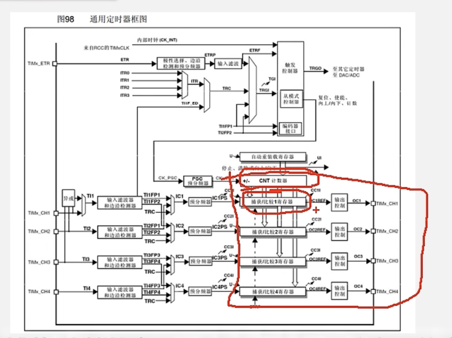

  - CCR是输入捕获和输出比较的功用寄存器单元。当设定为输出比较时，CCR中有一个固定值。CNT不断自增，当其值相比CCR中的固定值更小/大/相等时，就会输出1、0或翻转的操作——PWM波
  - 可以看出这个通用定时器有四个CCR寄存器，可以同时输出四路PWM波，但他们均共用一个CNT计数器。

- **每个高级定时器和通用计时器拥有4个输出比较通道**

- **高级定时器的前3个通道额外拥有死区生成和互补输出的功能**，**用于驱动三相无刷电机**

### P~ulse~W~idth~M~odulation~ 脉冲宽度调制

- #### 用数字信号实现模拟信号

  - **在==具有惯性的系统==中，可以通过一些脉冲的宽度进行调制，来等效地获得所需要的模拟参量**，常用于电机控速、亮度调节（传说中的高频PWM调光）

- #### 参数

  - 频率 $f = \frac1{T_S}$
  - 占空比  $=\frac{T_{ON}}{T_S}$，决定等效模拟电压大小，一般而言为线性变化。
  - 分辨率  $=$ 占空比变化步距，比如占空比每 $t$ 秒增加 $1$%，它的分辨率/步距就是 $1$%，指定了占空比变化的细腻程度

  > 简单的 **积分中值定理**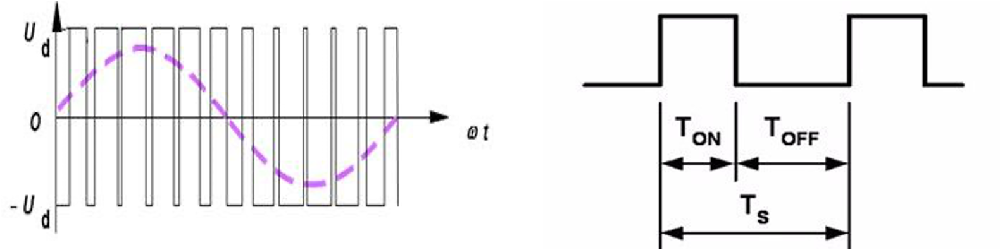

### 输出比较通道

- #### 高级输出比较通道（高级定时器的前三个输出通道）

  ​	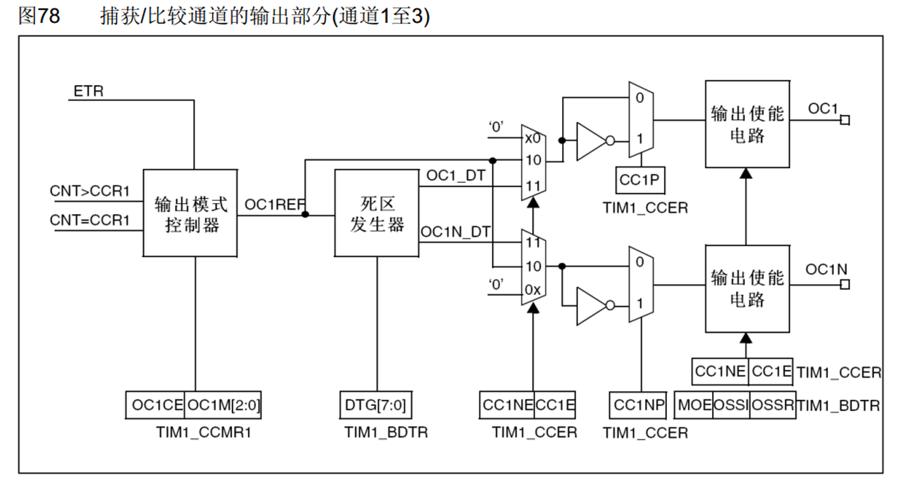

  - 高級輸出比較通道多出了死區發生器下的一大坨電路

    - OC1 和 OC1N 是兩個互补的输出端口，用于驱动一个标准推免输出模块

      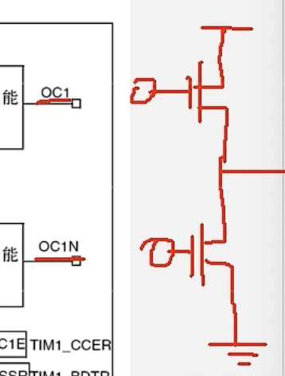

      - 上管导通，下管关闭——上侧VCC高电平输出到右侧输出口
      - 上管关闭，下管导通——右侧输出口直连下侧GND接地低电平
      - 上下都通——VCC直连GND：获得一个发亮的东西

    - OC1和OC1N虽然是互补的两个输出，但是很有可能由于器件的不理想，一个管还没完全关断，下管就已经导通了——BOOM

      - 所以产生了死区发生器——在电平发生变化的一段区间内“关闭”OC1和OC1N的输出，延迟一段时间再驱动推免输出模块

- #### 通用输出比较通道（通用定时器的输出通道以及高级定时器的第四个输出通道）

  ​	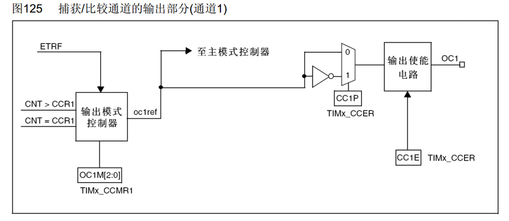

  - 图左侧边框外即是CNT和CCR1第一路的CCR寄存器，**经过比较输出结果**

    - CNT>CCR1 或 CNT = CCR1 时，就会给输出模式控制器传递一个信号

    - **输出模式控制器**就会改变它输出OC1REF的高低电平

      - **比较规则——输出比较模式：**

        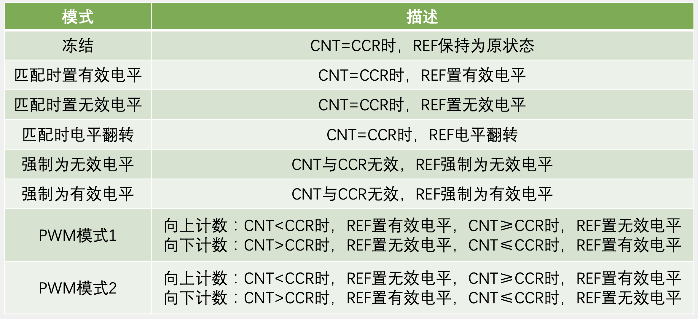

      > REF是 reference 的缩写，意思是参考信号
      >
      > 上方有一个ETRF输入，是定时器的一个小功能
      >
      > 此REF信号可以前往主模式控制器，并将其映射到主模式的TRGO输出上去。

  - REF的主要去向是走下面一路，到达**极性选择**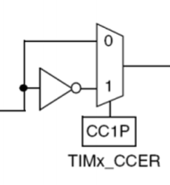

    - 给这个CC1 P寄存器写0，信号就会走上面的通路，就是信号电平不翻转
    - 写1的话信号就会往下走，通过一个非门取反，输出与REF电平相反的信号

  - 接着到达**输出使能电路**

    - 用于确定是否要输出该信号

  - 最后就是 **OC1** 引脚

    - 这个引脚就是CH1通道的引脚，在引脚定义表里就可以知道具体是哪个GPIO口了

### ==PWM基本结构==

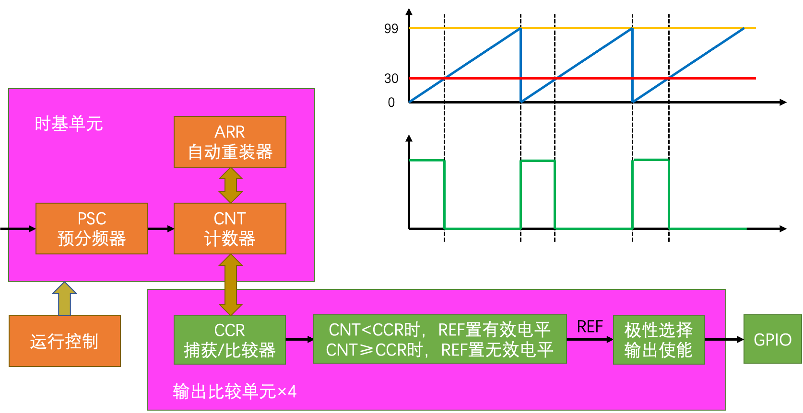

> 即是TIM中時基單元。不需要連結到後面的中斷部分。

- 右上圖是CNT的值，黃色線是ARR的值，紅色線是CCR的值

### 相关外设

#### 舵机

- 舵机是一种根据输入PWM信号占空比来控制输出角度的装置
- 输入PWM信号要求：周期为20ms，高电平宽度为0.5ms～2.5ms

> 舵机是将PWM当作一种通信协议来处理，而不是等效为模拟信号

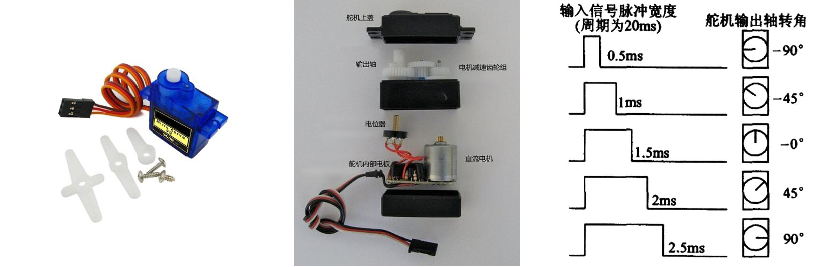

- ##### 硬件电路

  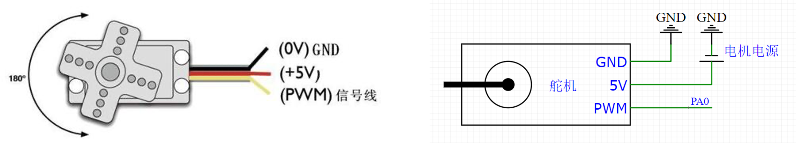

  - 单独供电时，供电的负极需要与STM32共地

#### 直流电机

>  ⚠️ 直流电机属于大功率器件，GPIO口无法直接驱动，需要配合电机驱动电路来操作

- TB6612是一款双路桥H型的直流电机驱动芯片，可以驱动两个直流电机并且控制其转速和方向

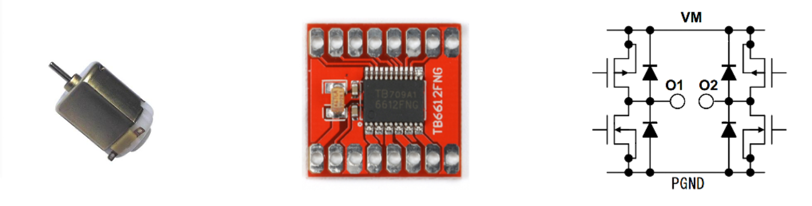

- ##### 硬件电路

  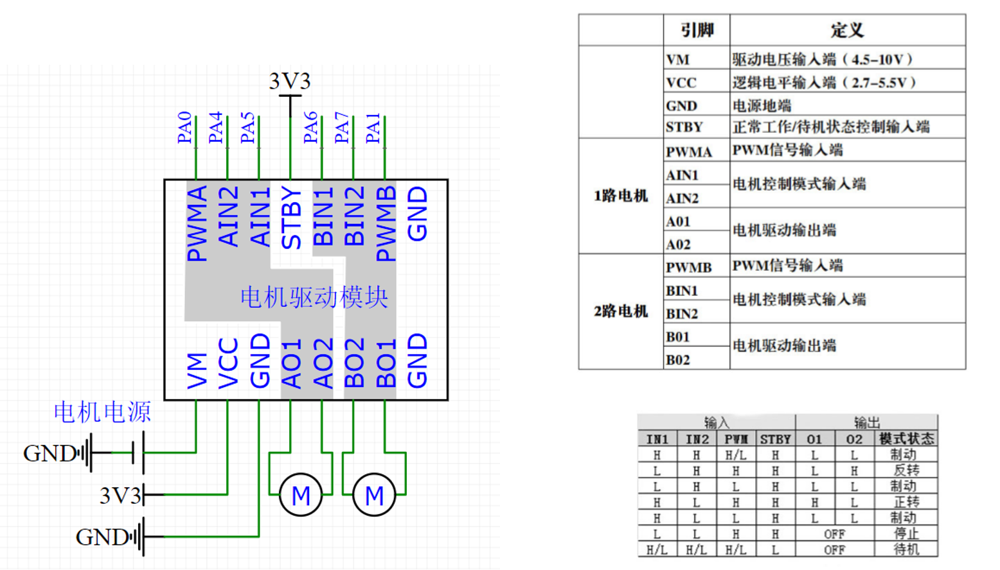

  - 两个电源：VM驱动电源（大功率） VCC逻辑电源（接板子上）
  - 三个GND：均互联等效，哪个方便接哪个
  - AB两路输出：可以接两个电机
    - 每一路有三个端口 PWM_X 、 X_IN1、X_IN2，接在GPIO上即可
    - PWM_X口需要接到PWM信号输出端，另外两个任意接通即可。这三个引脚给一个低功率的控制电路
    - 想要驱动电机：
      - IN1和IN2有电压差，其正负控制电机转动方向
      - PWM为高电平
    - 想要制动电机：
      - IN1和IN2均为**高**电平
      - 或IN1和IN2有电压差，但是PWM为低电平
  - STBY（stand by）待机控制引脚
    - 接通GND就待机，接VCC就正常工作

### PWM驱动呼吸灯


> 采取正极性驱动，观察更直观。占空比越大，灯越亮。


#### 书写PWM驱动文件

``` c
void PWM_Init(void)
{
```

- #### RCC开启时钟，打开TIM外设和GPIO外设的时钟

  ``` c
  	RCC_APB1PeriphClockCmd(RCC_APB1Periph_TIM2, ENABLE);
  	RCC_APB2PeriphClockCmd(RCC_APB2Periph_GPIOA, ENABLE);
  ```

- #### 配置GPIO口

  - 输出模式选择**复用推挽输出**

    - 本来GPIO的输出是由其自身的寄存器控制的。但是现在应该把控制权交给片上外设——TIM定时器。所以选择 AF_PP输出模式。根据引脚定义表，PA0口连接的片上外设就是TIM2的CH1通道。

    ``` c
    GPIO_InitTypeDef GPIO_InitStructure;
    	GPIO_InitStructure.GPIO_Mode = GPIO_Mode_AF_PP;
    	GPIO_InitStructure.GPIO_Pin = GPIO_Pin_0;		//GPIO_Pin_15;
    	GPIO_InitStructure.GPIO_Speed = GPIO_Speed_50MHz;
    	GPIO_Init(GPIOA, &GPIO_InitStructure);
    ```

  - #### 扩展：引脚重定义

    - 当你的PA0引脚被占用时，你需要参照引脚定义表将引脚重映射——使用AFIO口

    ``` c
    RCC_APB2PeriphClockCmd(RCC_APB2Periph_AFIO, ENABLE);
    //查阅手册，有四种重映射的方案。这里选择GPIO_PartialRemap1_TIM2方案
    GPIO_PinRemapConfig(GPIO_PartialRemap1_TIM2, ENABLE);
    //需要注意，TIM2_CH1对应PA0重映射的引脚PA15原本是GPIO复用的JTDI调试端口。我们必须先关闭调试端口的服用
    GPIO_PinRemapConfig(GPIO_Remap_SWJ_JTAGDisable, ENABLE);	 
    ```

    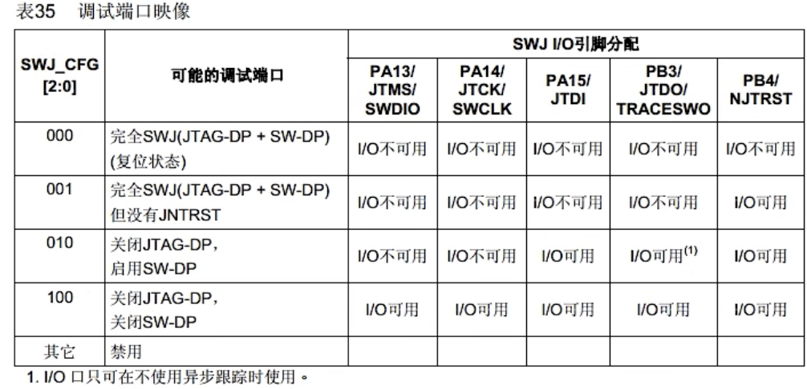

- #### 选择时钟源，配置时基单元

  ``` c
  	TIM_InternalClockConfig(TIM2);
  
  	TIM_TimeBaseInitTypeDef TIM_TimeBaseInitStructure;
  	TIM_TimeBaseInitStructure.TIM_ClockDivision = TIM_CKD_DIV1;
  	TIM_TimeBaseInitStructure.TIM_CounterMode = TIM_CounterMode_Up;
  	TIM_TimeBaseInitStructure.TIM_Period = 100 - 1;		//ARR
  	TIM_TimeBaseInitStructure.TIM_Prescaler = 720 - 1;		//PSC
  	TIM_TimeBaseInitStructure.TIM_RepetitionCounter = 0;
  	TIM_TimeBaseInit(TIM2, &TIM_TimeBaseInitStructure);
  ```

- #### 配置输出比较单元

  - 选择一个输出比较单元。不同的输出比较单元的GPIO口是不一样的，这个需要按照你对GPIO口的需求选择。我们选择PA0口，对应的就是第一个输出比较通道。

    >  在引脚定义表里有片上外设与引脚的对应关系

    - 值得注意的是，输出比较模式的结构体中有成员是仅仅高级定时器才会用到。但是我们此处书写的是通用计时器结构体，有两个成员悬空。这时候，我们会在指定结构体成员之前为结构体的每一个成员赋初始值——调用函数 `TIM_OCStructInit`

    ``` c
    TIM_OCInitTypeDef TIM_OCInitStructure;
    //初始化结构体
    TIM_OCStructInit(&TIM_OCInitStructure);
    //比较模式
    TIM_OCInitStructure.TIM_OCMode = TIM_OCMode_PWM1;
    //输出极性
    TIM_OCInitStructure.TIM_OCPolarity = TIM_OCPolarity_High;
    //输出使能
    TIM_OCInitStructure.TIM_OutputState = TIM_OutputState_Enable;
    //设置CCR
    TIM_OCInitStructure.TIM_Pulse = 0;
    
    //选择PA0口对应的OC1输出比较单元
    TIM_OC1Init(TIM2, &TIM_OCInitStructure);
    ```

- #### 配置GPIO

  - 将PWM对应的GPIO口，初始化为复用推免输出的配置

- #### 运行控制

  ``` c
  TIM_Cmd(TIM2, ENABLE);
  ```

#### 实现呼吸灯效果

- 决定LED亮度的是PWM波的占空比，想要亮度持续变化，就需要持续调整CCR的值

  - 调用 `TIM_SetCompare1` 的值来更改OC1输出模块的值

    ``` c
    void PWM_SetCompare1(uint16_t Compare)
    {
    	TIM_SetCompare1(TIM2, Compare);
    }
    ```

#### 主函数

``` c
#include "stm32f10x.h"                  // Device header
#include "Delay.h"
#include "OLED.h"
#include "PWM.h"

uint8_t i;

int main(void)
{
	OLED_Init();
	PWM_Init();
	//循环更改CCR的值，实现持续更改PWM波的占空比
	while (1)
	{
		for (i = 0; i <= 100; i++)
		{
			PWM_SetCompare1(i);
      //记得延时！
			Delay_ms(10);
		}
		for (i = 0; i <= 100; i++)
		{
			PWM_SetCompare1(100 - i);
			Delay_ms(10);
		}
	}
}
```

### PWM驱动舵机


#### 主函数

``` c
#include "stm32f10x.h"                  // Device header
#include "Delay.h"
#include "OLED.h"
#include "Servo.h"
#include "Key.h"

uint8_t KeyNum;
float Angle;

int main(void)
{
	OLED_Init();
	Servo_Init();
	Key_Init();
	
	OLED_ShowString(1, 1, "Angle:");
	
	while (1)
	{
		KeyNum = Key_GetNum();
		if (KeyNum == 1)
		{
			Angle += 30;
			if (Angle > 180)
			{
				Angle = 0;
			}
		}
		Servo_SetAngle(Angle);
		OLED_ShowNum(1, 7, Angle, 3);
	}
}
```

#### 舵机驱动

``` c
#include "stm32f10x.h"                  // Device header
#include "PWM.h"

void Servo_Init(void)
{
	PWM_Init();
}

void Servo_SetAngle(float Angle)
{
	PWM_SetCompare2(Angle / 180 * 2000 + 500);
}
```

#### PWM初始化

```c 
#include "stm32f10x.h"                  // Device header

void PWM_Init(void)
{
	RCC_APB1PeriphClockCmd(RCC_APB1Periph_TIM2, ENABLE);
	RCC_APB2PeriphClockCmd(RCC_APB2Periph_GPIOA, ENABLE);
	
	GPIO_InitTypeDef GPIO_InitStructure;
	GPIO_InitStructure.GPIO_Mode = GPIO_Mode_AF_PP;
	GPIO_InitStructure.GPIO_Pin = GPIO_Pin_1;
	GPIO_InitStructure.GPIO_Speed = GPIO_Speed_50MHz;
	GPIO_Init(GPIOA, &GPIO_InitStructure);
	
	TIM_InternalClockConfig(TIM2);
	
	TIM_TimeBaseInitTypeDef TIM_TimeBaseInitStructure;
	TIM_TimeBaseInitStructure.TIM_ClockDivision = TIM_CKD_DIV1;
	TIM_TimeBaseInitStructure.TIM_CounterMode = TIM_CounterMode_Up;
	TIM_TimeBaseInitStructure.TIM_Period = 20000 - 1;		//ARR
	TIM_TimeBaseInitStructure.TIM_Prescaler = 72 - 1;		//PSC
	TIM_TimeBaseInitStructure.TIM_RepetitionCounter = 0;
	TIM_TimeBaseInit(TIM2, &TIM_TimeBaseInitStructure);
	
	TIM_OCInitTypeDef TIM_OCInitStructure;
	TIM_OCStructInit(&TIM_OCInitStructure);
	TIM_OCInitStructure.TIM_OCMode = TIM_OCMode_PWM1;
	TIM_OCInitStructure.TIM_OCPolarity = TIM_OCPolarity_High;
	TIM_OCInitStructure.TIM_OutputState = TIM_OutputState_Enable;
	TIM_OCInitStructure.TIM_Pulse = 0;		//CCR
	TIM_OC2Init(TIM2, &TIM_OCInitStructure);
	
	TIM_Cmd(TIM2, ENABLE);
}

void PWM_SetCompare2(uint16_t Compare)
{
	TIM_SetCompare2(TIM2, Compare);
}
```

### PWM驱动直流电机


#### 主函数

``` c
#include "stm32f10x.h"                  // Device header
#include "Delay.h"
#include "OLED.h"
#include "Motor.h"
#include "Key.h"

uint8_t KeyNum;
int8_t Speed;

int main(void)
{
	OLED_Init();
	Motor_Init();
	Key_Init();
	
	OLED_ShowString(1, 1, "Speed:");
	
	while (1)
	{
		KeyNum = Key_GetNum();
		if (KeyNum == 1)
		{
			Speed += 20;
			if (Speed > 100)
			{
				Speed = -100;
			}
		}
		Motor_SetSpeed(Speed);
		OLED_ShowSignedNum(1, 7, Speed, 3);
	}
}
```

#### 电机驱动

``` c
#include "stm32f10x.h"                  // Device header
#include "PWM.h"

void Motor_Init(void)
{
	RCC_APB2PeriphClockCmd(RCC_APB2Periph_GPIOA, ENABLE);
	
	GPIO_InitTypeDef GPIO_InitStructure;
	GPIO_InitStructure.GPIO_Mode = GPIO_Mode_Out_PP;
	GPIO_InitStructure.GPIO_Pin = GPIO_Pin_4 | GPIO_Pin_5;
	GPIO_InitStructure.GPIO_Speed = GPIO_Speed_50MHz;
	GPIO_Init(GPIOA, &GPIO_InitStructure);
	
	PWM_Init();
}

void Motor_SetSpeed(int8_t Speed)
{
	if (Speed >= 0)
	{
		GPIO_SetBits(GPIOA, GPIO_Pin_4);
		GPIO_ResetBits(GPIOA, GPIO_Pin_5);
		PWM_SetCompare3(Speed);
	}
	else
	{
		GPIO_ResetBits(GPIOA, GPIO_Pin_4);
		GPIO_SetBits(GPIOA, GPIO_Pin_5);
		PWM_SetCompare3(-Speed);
	}
}
```

## 输入捕获 I~nput~C~apture~

- 输入捕获模式下，当通道输入引脚出现指定电平跳变时，当前CNT的值将被锁存到CCR中，可用于测量PWM波形的频率、占空比、脉冲间隔、电平持续时间等参数。

- 每个高级定时器和通用定时器都拥有4个输入捕获通道。

  - 这4个输入捕获和4个输出比较通道共用4个CCR寄存器和引脚，所以同一通道不能同时使用IC和OC

- 可以配置为PWMI模式，同时测量频率和占空比

- 可配合主从出发模式，实现硬件全自动测量

- 对于输入捕获，高级定时器和通用定时器没有区别；基本定时器没有输入捕获的功能。

  > 可配合主从触发模式，实现硬件全自动测量，软件不需要进行任何干预，也不需要进中断，需要测量的时候直接读取CCR寄存器即可。

### 输入捕获基本结构

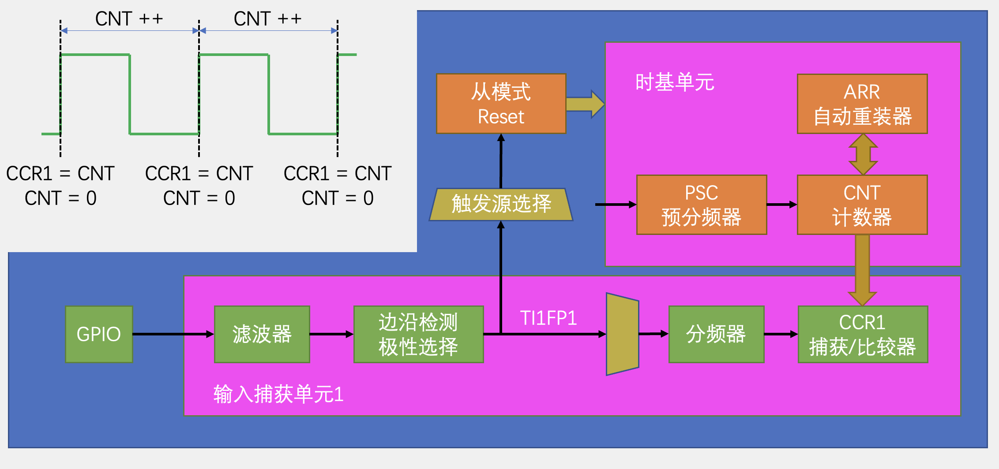 

### PWMI基本结构

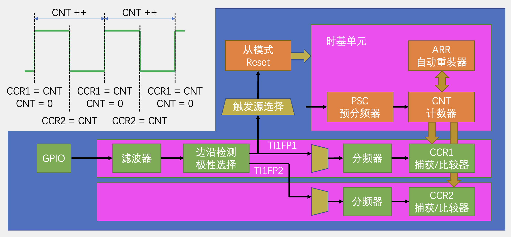

- 使用两个通道同时捕获一个针脚，可以同时测量频率和占空比。

### 频率测量

> STM只能测量数字信号。欲测量正弦波，需要搭建一个信号与处理电路。注意输入给STM32的信号电压不要太高。

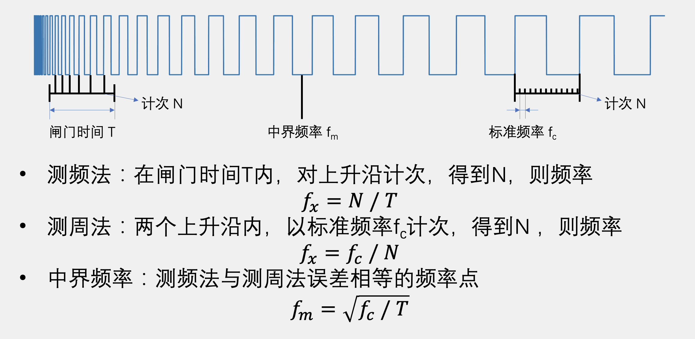

- 测频法适合高频信号，其结果更新相对较慢，由于本质上测量的是一段时间内的平均频率，所以自带滤波效果，测量值变化平稳
- 测周法适合低频信号，其结果更新更快，数据更新快，但容易受到噪声影响
- 标准频率指的是CNT计数器自增的频率，是由计数器所选择的时钟源和预分频器共同决定的。

### 输入捕获通路

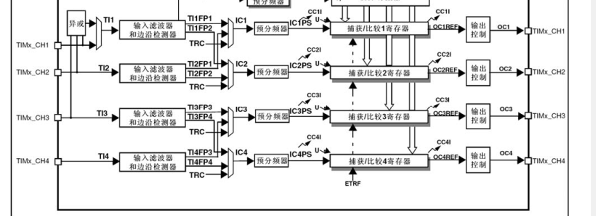

> 上方的异或门是为三相无刷电机服务的。异或门的右侧有一个数据选择器，若选择上路，输入通道1的值为CH123三个值的异或值。选择下路则可以忽略这个异或门。

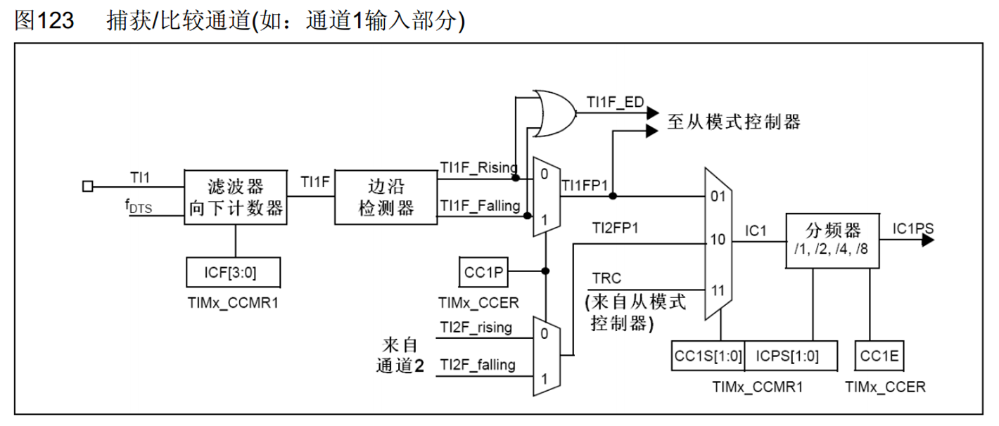

- 输入后会进入到 “输入滤波器和边沿检测器”

  - 滤波器：可以简单滤波，避免一些高频的毛刺信号误触发。

    - f~DTS~ 是滤波器的采样时钟来源，CCMR1寄存器中的ICF位可以控制滤波器的参数。滤波器以某采样频率对输入信号进行采样，当连续N个值都为高/低电平，输出才是高/低电平。当连续N个值里并都是高/低电平时，滤波器将持续输出片刻之前的信号，不会改变到高/低电平。采样瓶绿越低，采样个数N越大，滤波效果就越好。

      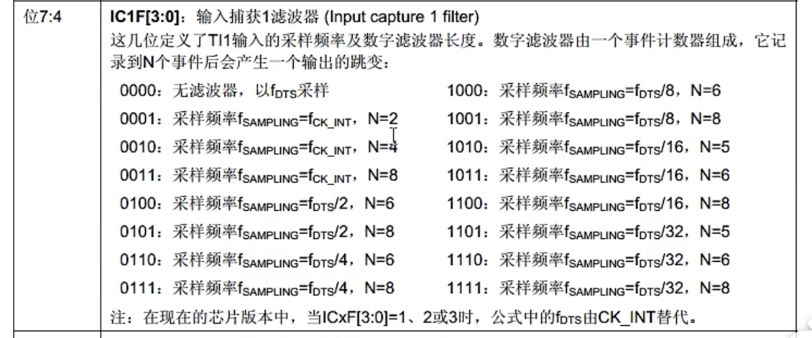

      

  - 边沿检测器：类似于外部中断，可以选择高/低电平触发。当出现指定的电平时，边沿检测电路就会触发后续电路执行动作。

    - 滤波之后的信号通过边沿检测器，捕获上升沿或者下降沿，使用CCER寄存器里的CC1P位，就可以选择极性了，最终的到TI1FP_x_触发信号

  - 每一个通道有两套输入滤波器和边沿检测器。对应输出TI1FP_X（X为1或2），会连接到对应的通道X。

    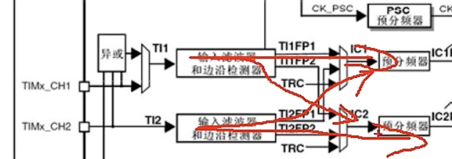

    - 这样做可以让CH1输入的信号传递到CH2……
      - 可以灵活切换后续捕获电路的输入
      - 可以将一个引脚的输入同时映射到两个捕获单元，是PWMI模式的经典结构

  - 除了TF_X_FP_X输入到预分频器，还有TRC能输入。这是用为三相无刷电机服务的。

  - 每个通道各有一个预分频器。分频之后的触发信号就可以出发捕获电路进行工作了。

    - TIM_X_CCMR1寄存器中的CC1S位可以对数据选择器选择输入到预分频器的信号
    - 之后的ICPS位可以配置这里的分频器
    - 之后TIM_X_CCER寄存器中的CC1E位用于控制输出使能或失能。选择使能后，就可以输出到IC1PS

  - IC1PS每来一个出发信号，CNT的值就会向CCR转运一次，转运的同时，会发生一个捕获事件

    - 每捕获一次CNT的值，就要将CNT清零，以便于下一次捕获。

      > 这是由硬件电路在捕获之后自动完成CNT的清零工作。
      >
      > 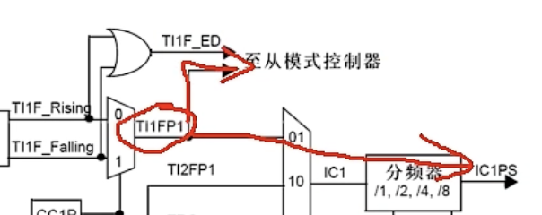
      >
      > TI1FP1信号和TI1的边沿信号都可以通向从模式控制器，直接触发从模式。
      >
      > 从模式中就有电路可以自动完成CNT的清零。
      >
      > ⚠️ 需要先转运再清零或者非阻塞的同时转运0和CNT

  - 这个事件会在状态寄存器 置标志位，同时也可以产生中断

    - **如果需要再捕获的瞬间，处理一些事情的话，就可以开启这里的捕获中断**

- 假设我们设定每输入一个上升沿，CCR就捕获一次CNT的值。这样，就可以用所捕获的CNT的数值来记录两个上升沿之间的时间间隔——周期

### 若干问题

- 信号频率太低，CNT计数值可能会溢出。
- 从模式的触发源选择只有TI1FP1和TI2FP2哦，没有TI3和TI4。所以此时只能用CH1和CH2来实现硬件自动清零CNT。对于CH3和CH4就只能开启捕获中断。但是程序会频繁中断运行，比较消耗软件资源。

## 主从触发模式

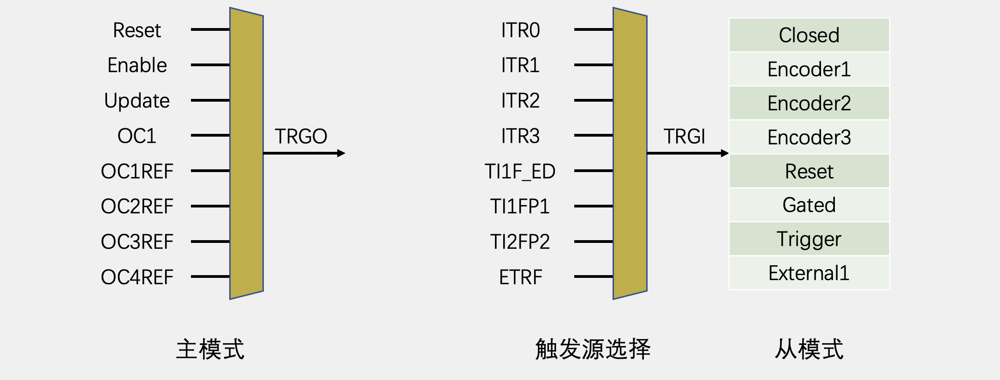

###  主模式

- 将定时器内部的信号，映射到TRGO引脚，用于触发别的外设

  > **定时器级联**
  >
  > 可以选择一个定时器主模式输出更新信号到TRGO，另一个定时器选择上一个定时器触发从模式，从模式选择执行外部时钟模式1的操作

  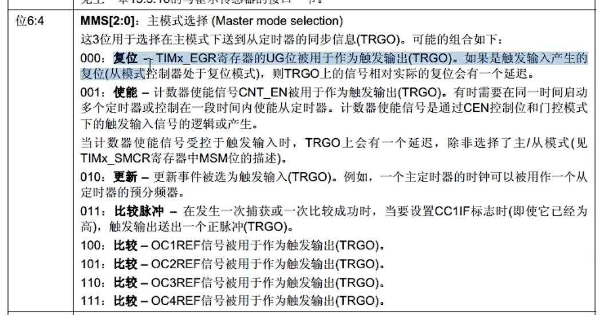

### 从模式

- 接受自身、其他外设的一些信号，用于控制自身定时器的运行，也就是被别的信号控制

  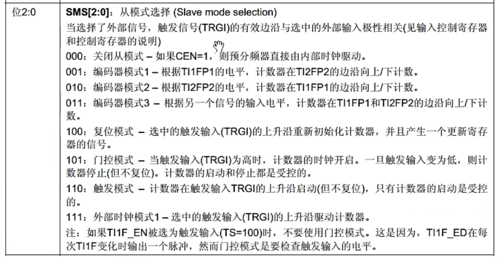

### 触发源选择

- 用于选择从模式的触发源。可以认为是从模式的一部分。

- 选择指定的一个信号，得到TRGI，TRGI去触发从模式中列表的一项操作来自动执行

  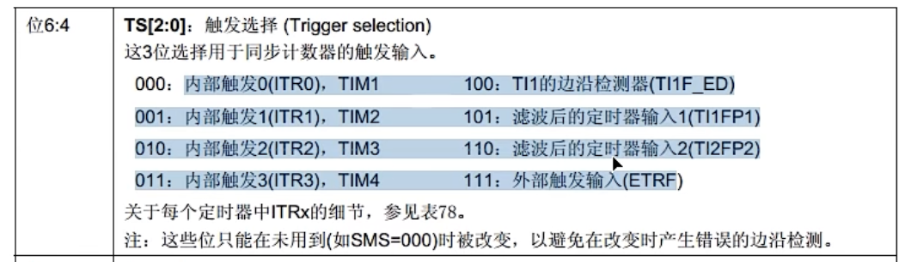

#### 实现捕获一次CNT后清空CNT

- ##### 选择触发源的TI1FP1

- **从模式执行Reset**

### 初始化结构体

#### 普通输入捕获

``` c
//初始化定时器的输入捕获功能结构体
TIM_ICInitTypeDef TIM_ICInitStructure;
//选择通道
TIM_ICInitStructure.TIM_Channel = TIM_Channel_1;
//配置滤波器。值从0x0到0xF，值越大效果越好
TIM_ICInitStructure.TIM_ICFilter = 0xF;
//配置边沿检测是上升沿触发还是下降沿触发
TIM_ICInitStructure.TIM_ICPolarity = TIM_ICPolarity_Rising;
//预分频器，对信号本身计次后改变频率
TIM_ICInitStructure.TIM_ICPrescaler = TIM_ICPSC_DIV1;
//配置分频器前的数据选择器。可以选择是直连还是交叉还是TRC输入
TIM_ICInitStructure.TIM_ICSelection = TIM_ICSelection_DirectTI;
TIM_ICInit(TIM3, &TIM_ICInitStructure);
```

#### PWMI输入捕获

> 配置位两个通道同时捕获一个引脚的模式

- #### 方案一：复制一份普通输入模式，粘贴在下方，再做出修改

``` c
TIM_ICInitTypeDef TIM_ICInitStructure;
TIM_ICInitStructure.TIM_Channel = TIM_Channel_2;//修改通道
TIM_ICInitStructure.TIM_ICFilter = 0xF;
TIM_ICInitStructure.TIM_ICPolarity = TIM_ICPolarity_Falling;//修改为下降沿触发
TIM_ICInitStructure.TIM_ICPrescaler = TIM_ICPSC_DIV1;
TIM_ICInitStructure.TIM_ICSelection = TIM_ICSelection_IndirectTI;//修改为交叉输入
TIM_ICInit(TIM3, &TIM_ICInitStructure);
```

- #### 方案二：有现成的函数——只需要将 `TIM_ICInit` 函数更改为 `TIM_PWMIConfig`

``` c
TIM_ICInitTypeDef TIM_ICInitStructure;
TIM_ICInitStructure.TIM_Channel = TIM_Channel_1;
TIM_ICInitStructure.TIM_ICFilter = 0xF;
TIM_ICInitStructure.TIM_ICPolarity = TIM_ICPolarity_Rising;
TIM_ICInitStructure.TIM_ICPrescaler = TIM_ICPSC_DIV1;
TIM_ICInitStructure.TIM_ICSelection = TIM_ICSelection_DirectTI;
TIM_PWMIConfig(TIM3, &TIM_ICInitStructure);/
```

> ⚠️ 该函数仅支持 CH1 和 CH2

### 配置从模式

``` c
//选择触发源
TIM_SelectInputTrigger(TIM3, TIM_TS_TI1FP1);
//选择从模式
TIM_SelectSlaveMode(TIM3, TIM_SlaveMode_Reset);
```

### 计算频率

``` c
uint32_t IC_GetFreq(void)
{
  //f_n = f_c / N_CCR
	return 1000000 / (TIM_GetCapture1(TIM3) + 1);
}
```

### 计算占空比

``` c
uint32_t IC_GetDuty(void)
{
	return (TIM_GetCapture2(TIM3) + 1) * 100 / (TIM_GetCapture1(TIM3) + 1);
}
```

> 计算频率和占空比总会有正负1的误差。所以选择加括号加减1的方式手动调一下输出。


## 编码器接口 E~ncoder~I~nterface~

- 编码器接口可以接受增量（正交）编码器的信号，根据编码器旋转产生的正交信号脉冲，自动控制CNT自增或自减，从而指示编码器位置、旋转方向和旋转速度
- **两个输入引脚借用了输入捕获的 通道1 和 通道2**

- 编码器类似于外部时钟的作用。
  - 编码器正转，控制CNT自增
  - 编码器反转，控制CNT自减
- 每隔一段时间，读取CNT的值，类似于IC的模式就能测出变化的速率

###  正交编码器

>  两相之间相差九十度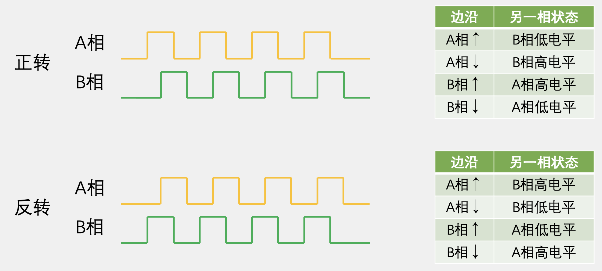

### 基本结构

- **每个高级定时器和通用定时器都拥有1个编码器接口**

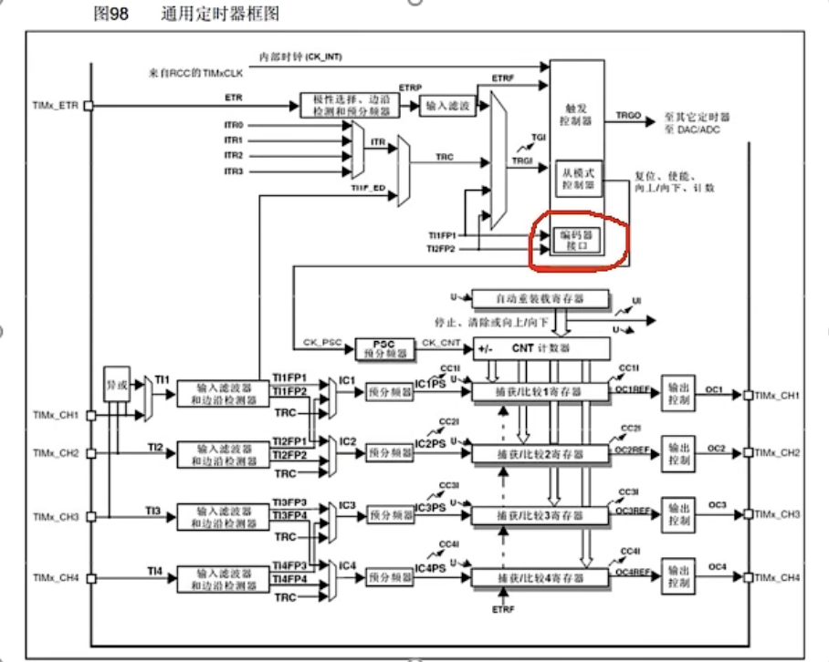

- ##### 基本定时器没有编码器接口

  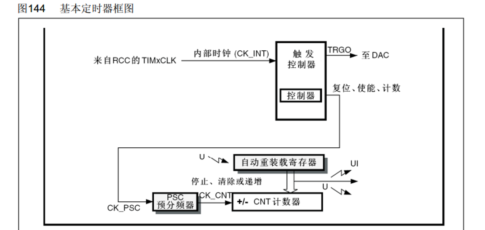

- #### 两个输入端

  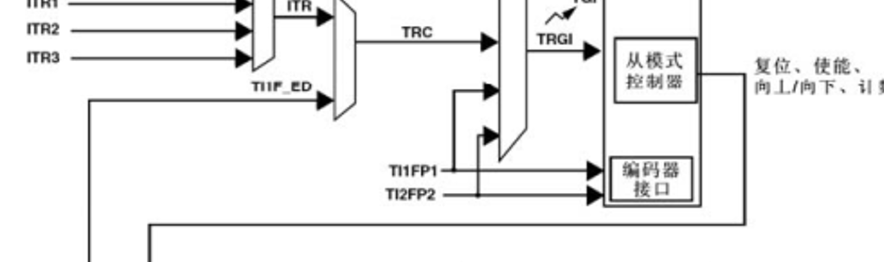

  - 这里编码器接口有两个输入端，分别接入编码器的A相和B相

    - 这两个输入端是TI1FP1和TI2FP2，借用的是输入捕获CH1和CH2的两个引脚

      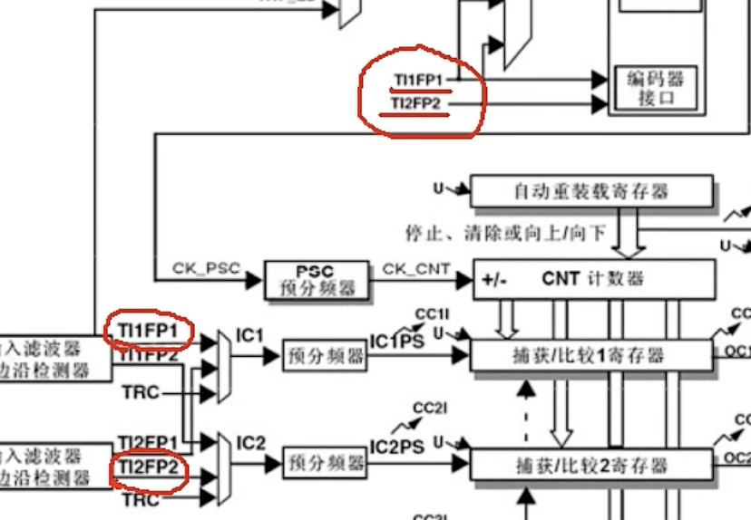

- #### 输出

  - 相当于从模式控制器，去控制CNT的计数时钟和计数方向 

    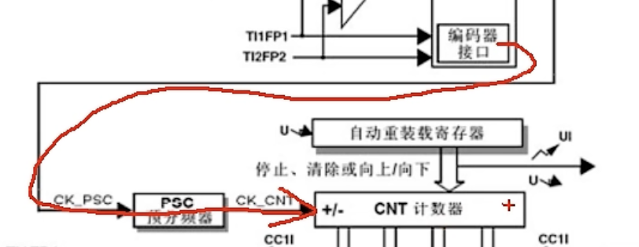

    - 之前使用的72MHz内部时钟和我们在時基單元初始化時設置的計數方向並不會啟用，這兩個都已被編碼器接口託管

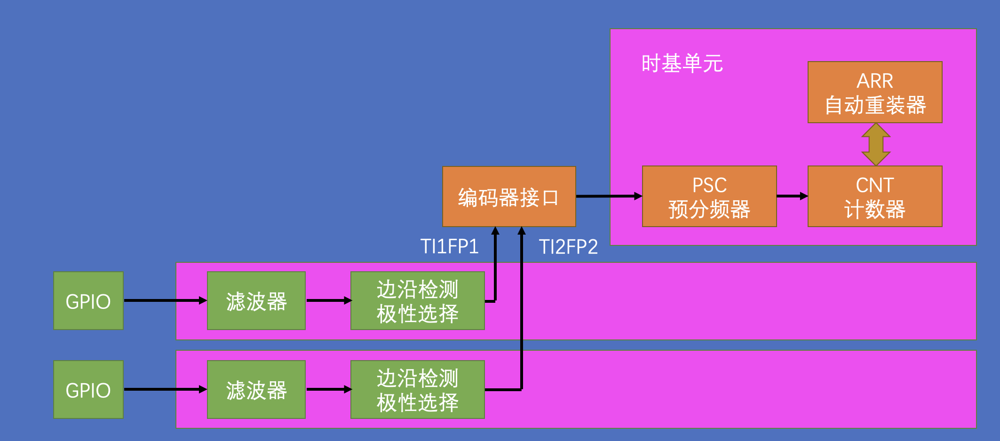

- 一般設置ARR為最大值65535.利用补码的特性很容易得到负值

### 工作模式

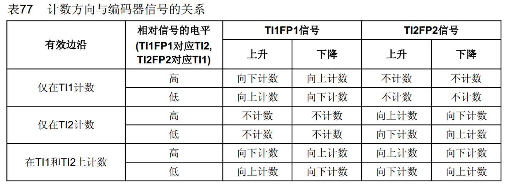


- #### 实例1

  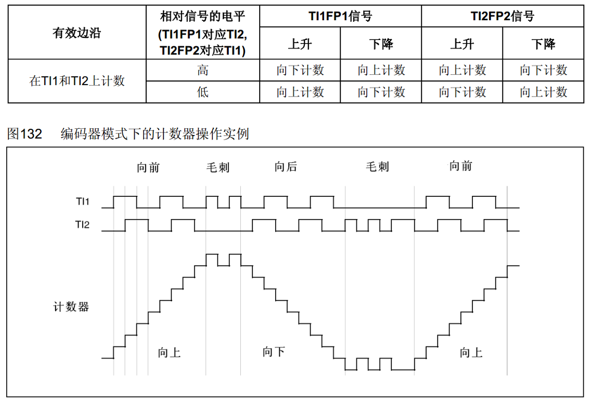

- #### 实例2

  - 可以将任意一个通道的极性反转，实现反向计数；也可以把两个引脚交换一下。

  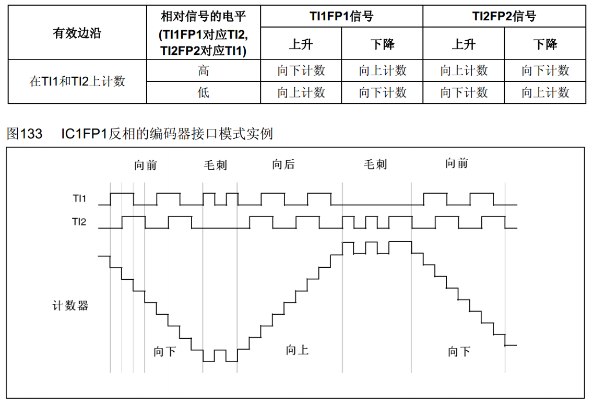

### 旋转编码器接口测速

> 本质上与前面旋转编码器测速是一个原理。但是那时用的EXTI外部中断，调用中断函数手动计次。这次使用编码器接口，好处是节约软件资源。

 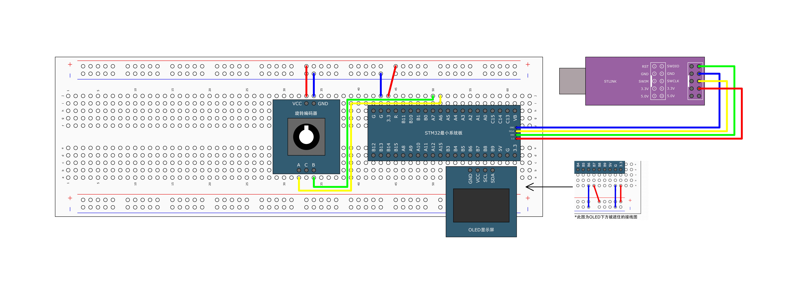

``` c
void Encoder_Init(void)
{
  //开启时钟
	RCC_APB1PeriphClockCmd(RCC_APB1Periph_TIM3, ENABLE);
	RCC_APB2PeriphClockCmd(RCC_APB2Periph_GPIOA, ENABLE);
	//GPIO初始化 TIM3_CH1/2 对应的针脚
	GPIO_InitTypeDef GPIO_InitStructure;
	GPIO_InitStructure.GPIO_Mode = GPIO_Mode_IPU;//至于上拉和下拉的选择，一般可以来看一下接在这个引脚的外部模块输出的默认电平。习惯状态是默认高电平。
	GPIO_InitStructure.GPIO_Pin = GPIO_Pin_6 | GPIO_Pin_7;
	GPIO_InitStructure.GPIO_Speed = GPIO_Speed_50MHz;
	GPIO_Init(GPIOA, &GPIO_InitStructure);
  
  //
  /*去掉了时钟源选择*/
  //
	//初始化时基单元
	TIM_TimeBaseInitTypeDef TIM_TimeBaseInitStructure;
	TIM_TimeBaseInitStructure.TIM_ClockDivision = TIM_CKD_DIV1;
	TIM_TimeBaseInitStructure.TIM_CounterMode = TIM_CounterMode_Up;//这里设置没有用——计数方向被编码器托管
	TIM_TimeBaseInitStructure.TIM_Period = 65536 - 1;		//ARR
	TIM_TimeBaseInitStructure.TIM_Prescaler = 1 - 1;		//PSC
	TIM_TimeBaseInitStructure.TIM_RepetitionCounter = 0;
	TIM_TimeBaseInit(TIM3, &TIM_TimeBaseInitStructure);
	//配置输入通道的滤波器和边沿检测&极性检测
	TIM_ICInitTypeDef TIM_ICInitStructure;
	TIM_ICStructInit(&TIM_ICInitStructure);
	TIM_ICInitStructure.TIM_Channel = TIM_Channel_1;
	TIM_ICInitStructure.TIM_ICFilter = 0xF;
	TIM_ICInit(TIM3, &TIM_ICInitStructure);
	TIM_ICInitStructure.TIM_Channel = TIM_Channel_2;
	TIM_ICInitStructure.TIM_ICFilter = 0xF;
	TIM_ICInit(TIM3, &TIM_ICInitStructure);
	//
	TIM_EncoderInterfaceConfig(TIM3, TIM_EncoderMode_TI12, TIM_ICPolarity_Rising, TIM_ICPolarity_Rising);
	
	TIM_Cmd(TIM3, ENABLE);
}

int16_t Encoder_Get(void)
{
	int16_t Temp;
	Temp = TIM_GetCounter(TIM3);
	TIM_SetCounter(TIM3, 0);
	return Temp;
}
```

