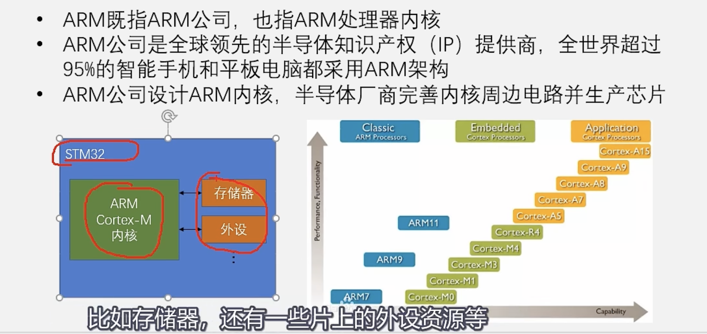
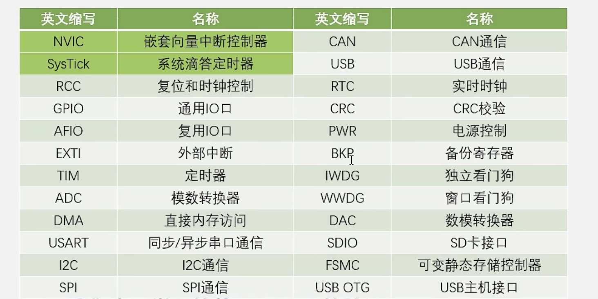
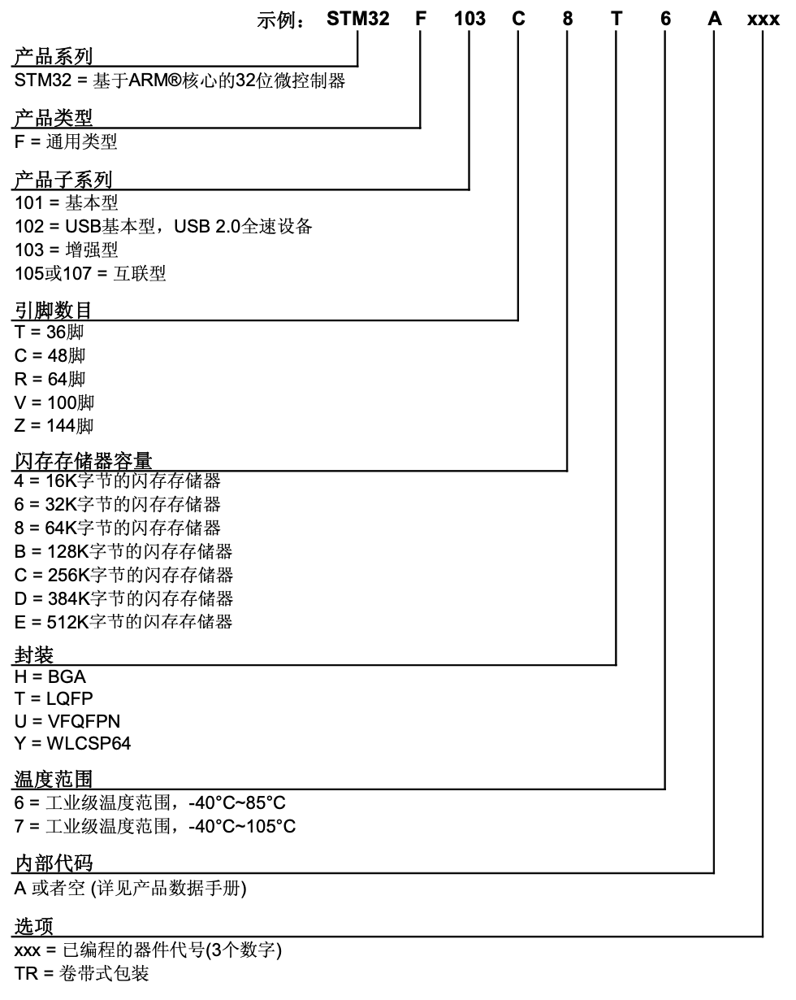
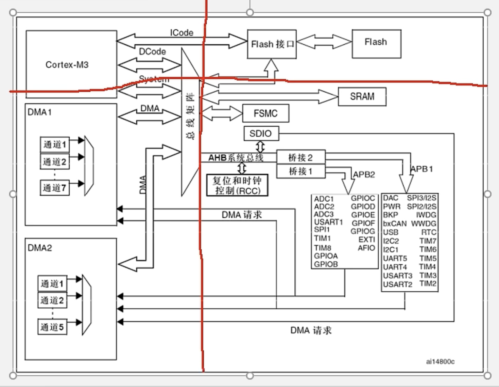
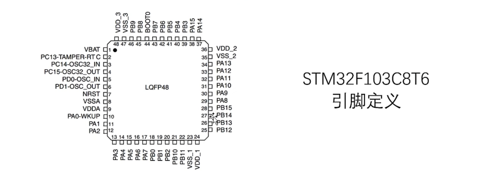
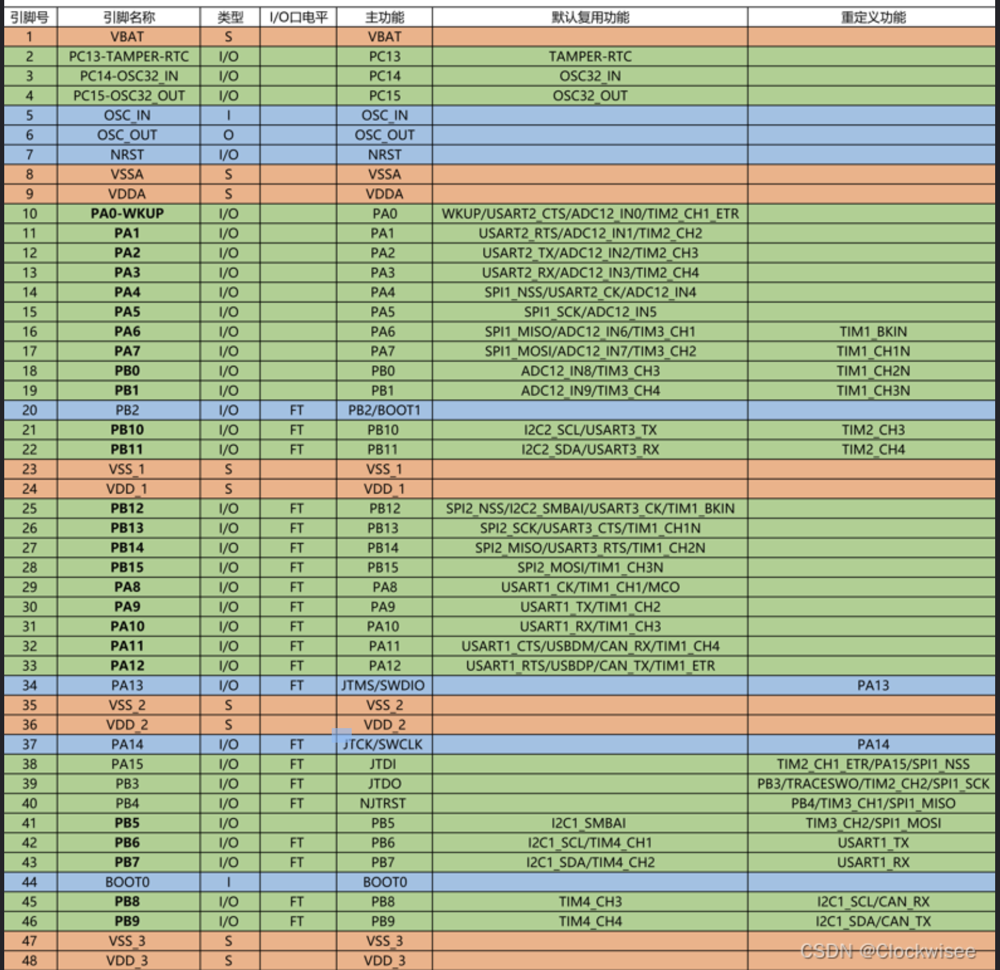
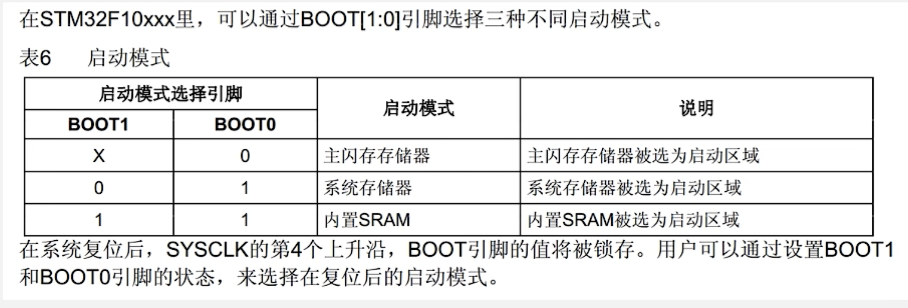
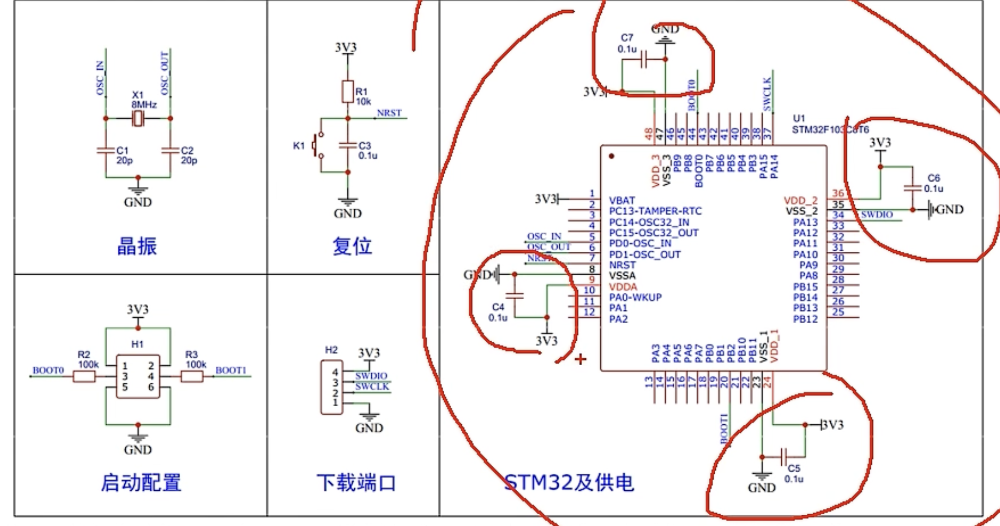

https://blog.csdn.net/weixin_61203118/article/details/125860600

## STM32

- 是ST公司基于ARM Cortex-M 内核开发的32位微控制器（MCU）

## ARM

-   当前使用STM32F103C8T6

## 系列外设 Peripheral

- 将来的主要学习内容。
  - 通过程序配置外设来实现特殊功能

## 命名规则

## 系统结构

- 左上角
  - ARM内核
  - 引出三条总线
    - Icode加载指令、Dcode加载数据
    - Sys总线连接其他
- 左下角
  - DMA，CPU的秘书
  - 负责大量数据搬运
- 右下角
  - 一系列外设连接 
  - 性能：AHB>APB2>APB1（注意关注这三者里面的外设，其实后两者性能差不多）

## 引脚定义

- 拿到新的芯片时，需要着重的了解其引脚定义。这样就能大概了解芯片的使用方法了

- 左上角的小黑点为起点，逆时针为正序

- 下表为引脚列表

  - 红色为电源相关 （S）
  - 蓝色为最小系统相关的引脚
  - 绿色为IO口、功能口等引脚
  - FT代表能承受5V电压，否则为3.3V

  

  - 不要轻易使用PA15，PB3，PB4，他们是作为调试端口的

## 启动配置

## 引脚定义

- 如果想让STM32 正常工做，就要首先将蓝色（最小系统电路）和红色（电源）的电路连接好。
  - 最小系统电路

