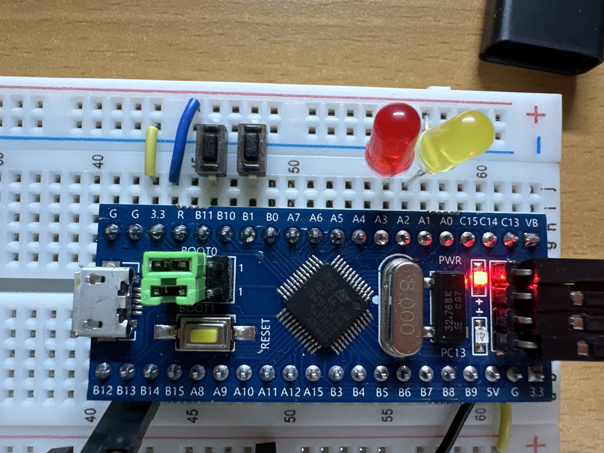

# 3.2 读取按键

## GPIO初始化为上拉输入

> 按键按下之间均为断路，需要输入默认为高电平状态的上拉输入模式

``` c
void Key_Init(void)
{
  //第一步永远是开启时钟
	RCC_APB2PeriphClockCmd(RCC_APB2Periph_GPIOB, ENABLE);
	//初始化结构体变量
	GPIO_InitTypeDef GPIO_InitStructure;
	GPIO_InitStructure.GPIO_Mode = GPIO_Mode_IPU;
	GPIO_InitStructure.GPIO_Pin = GPIO_Pin_1 | GPIO_Pin_11;
	GPIO_InitStructure.GPIO_Speed = GPIO_Speed_50MHz;
  //开启对应端口的上拉输入模式
	GPIO_Init(GPIOB, &GPIO_InitStructure);
}
```

## 检测按下了何处的按键

- 使用`uint8_t`作为按键的代号

### GPIO返回值

``` c
//读取数据寄存器某一个端口的输入值，两个参数指定GPIOA/B/C……以及针脚编号
//返回值为uint_8，代表这个端口的高低电平
uint8_t GPIO_ReadInputDataBit(GPIO_TypeDef* GPIOx, uint16_t GPIO_Pin);
//比上个函数少了一个bit——一次性读取整个GPIOA/B/C……寄存器的电平
//返回值是一个16位的数据，每一位代表一个端口的电平
uint16_t GPIO_ReadInputData(GPIO_TypeDef* GPIOx);
//这个函数是用来读取输出数据寄存器的某一个位。原则上来说它并不是用来读取端口的输入数据
uint8_t GPIO_ReadOutputDataBit(GPIO_TypeDef* GPIOx, uint16_t GPIO_Pin);
uint16_t GPIO_ReadOutputData(GPIO_TypeDef* GPIOx);
```


### 检测按键

-  此处，按键一段接入 B1、B11端口，默认上拉输入，为高电平状态。

  

``` c
uint8_t Key_GetNum(void)
{
  //定义变量表示按下的按键代号，0代表没有按键没有按下
	uint8_t KeyNum = 0;
  //按键检测到为0代表是读取到低电平——按键上端是接入的GND
	if (GPIO_ReadInputDataBit(GPIOB, GPIO_Pin_1) == 0)
	{
    //按键刚按下时电流有抖动，需要Delay一下
		Delay_ms(20);
    //按键会持续按下一段时间，使用while循环
		while (GPIO_ReadInputDataBit(GPIOB, GPIO_Pin_1) == 0);
    //按键抬起时也会有电流抖动
		Delay_ms(20);
		KeyNum = 1;
	}
  //同理
	if (GPIO_ReadInputDataBit(GPIOB, GPIO_Pin_11) == 0)
	{
		Delay_ms(20);
		while (GPIO_ReadInputDataBit(GPIOB, GPIO_Pin_11) == 0);
		Delay_ms(20);
		KeyNum = 2;
	}
	//返回按键值
	return KeyNum;
}
```

## 主函數

``` c
int main(void)
{
	LED_Init();
	Key_Init();
	
	while (1)
	{
		KeyNum = Key_GetNum();
    //檢測按鍵
		if (KeyNum == 1)
		{
      //調整對應LED的亮滅
			LED1_Turn();
		}
		if (KeyNum == 2)
		{
			LED2_Turn();
		}
	}
}

```

## 控制LED的函數

- 我們需要按下同一個開關來切換LED的亮滅，而不是一個開關負責打開，一個開關負責關閉
- 調用LED是靠輸出寄存器對應的電平。所以我們的思路是讀取輸出寄存器的電平並反轉之——本來是低電平電量，就反轉成高電平

``` c
void LED1_Turn(void)
{
  //調用GPIO_ReadOutputDataBit函數讀取輸出寄存器
	if (GPIO_ReadOutputDataBit(GPIOA, GPIO_Pin_1) == 0)
	{
		GPIO_SetBits(GPIOA, GPIO_Pin_1);
	}
	else
	{
		GPIO_ResetBits(GPIOA, GPIO_Pin_1);
	}
}
```


### 類似的外設

- 蜂鳴器
- 光敏傳感器