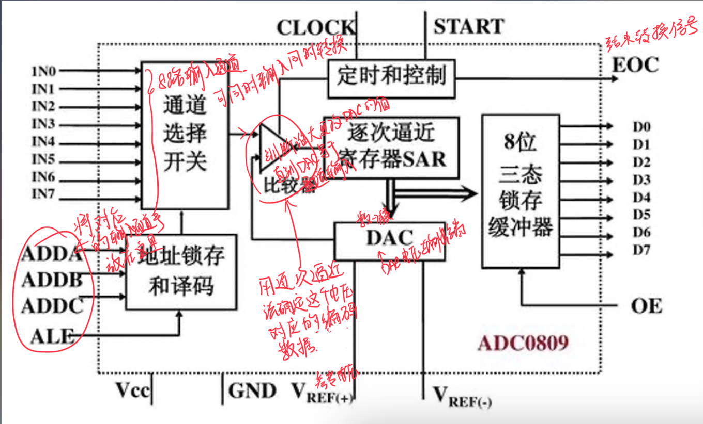
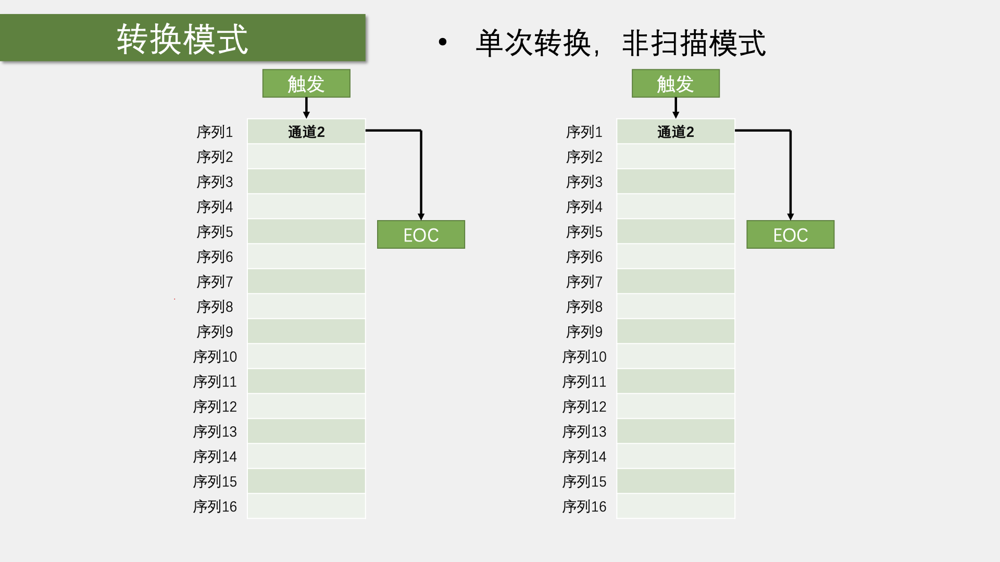
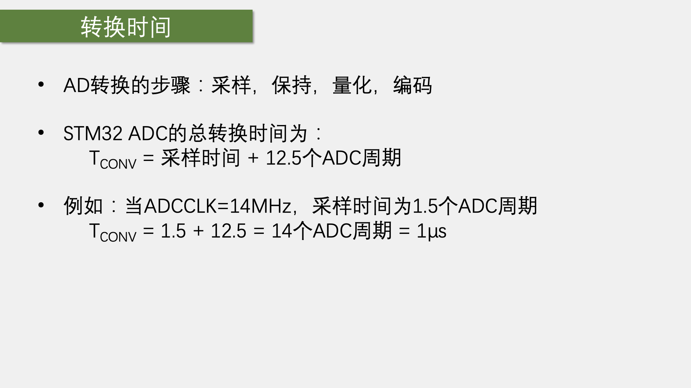

# A~nalog~D~igtial~C~onverter~模数转换

> 有将模拟转换为数字的转换器ADC，自然也有数字到模拟的转换器DAC。但上一节的PWM抢了他很多活。

- ADC（Analog-Digital Converter）模拟-数字转换器
- ADC可以将引脚上连续变化的模拟电压转换为内存中存储的数字变量，建立模拟电路到数字电路的桥梁
- 12位（分辨率）逐次逼近型（一种ADC的工作模式）ADC，1us转换时间（1MHz的转换频率——从模拟转换成数字所需要花费的时间，一微秒已经是最小的时间段）
  - 输入电压范围：0～3.3V，转换结果范围：0～4095 （2^12^-1)（电压范围与转换结果范围是线性关系）
  - 18个输入通道，可测量16个外部和2个内部信号源
- 规则组和注入组两个转换单元
  - STM32的高级功能——列一个组，一次性启动一个组，连续转换多个值
  - 两个组，规则组平常使用，注入组用于突发事件
- 模拟看门狗自动监测输入电压范围
- STM32F103C8T6 ADC资源：ADC1、ADC2，10个外部输入通道

## 逐次逼近型ADC

## STM32的ADC框图

### 16个输入通道对应的引脚

- ADC1和2的通道一致——是为了实现一个高级功能：双ADC交叉采样、双ADC同步采样模式等

## 四种工作模式

> 还有间断模式，可供了解

- 规则组里的“菜单”，有16道菜可以点
- 转换结束后会在EOC置标识位，然后就可以在寄存器里读取结果了

- #### 非扫描模式

  - 整个菜单只有序列1有效，选中一组菜单等小于选择一个

- #### 扫描模式

  - 每个序列里可以选择任意通道
  - 为了防止多个序列产生的数据被覆盖，就需要DMA及时将他们转运走

- #### 连续转换模式

  - 在一次转换后不会停止，而是立刻开始下一轮的转换。全自动运行，也不用管多久停止，多就要数据直接去寄存器里读取

### 单次转换，非扫描模式

### 连续转换，非扫描模式

### 单次转换，扫描模式

### 连续转换，扫描模式

## 数据对齐

> 这个ADC是12位的，填不满16位寄存器。

> 每向左移动一位，数据就会比原来大两倍

## 转换时间

> 采样、保持：在至此比较的过程中保持外部电压保持不变
>
> 量化、编码：逐次比较的过程
>
> 采样时间越长，抗毛刺越强

## 校准

- 只需要在初始化后加几句话就行

## 硬件电路

## 配置步骤

- #### 开启RCC时钟，包括ADC和GPIO的时钟

  - 还需要配置一下ADCCLK分频器

- #### 将GPIO配置为模拟输入模式

- #### 配置多路开关，把左边的通道接入到右边的规则组列表里

- #### 配置ADC转换器

  - 单次连续转换
  - 扫描/非扫描模式
  - 有几个通道
  - 触发源什么
  - 数据对齐是左对齐还是右对齐

- #### （可选）配置模拟看门狗

- #### （可选）ITConfig开启中断输出，再配置NVIC中断

- #### 调用ADC_Cmd函数开启ADC
