# USART 串口通信

## 通信接口

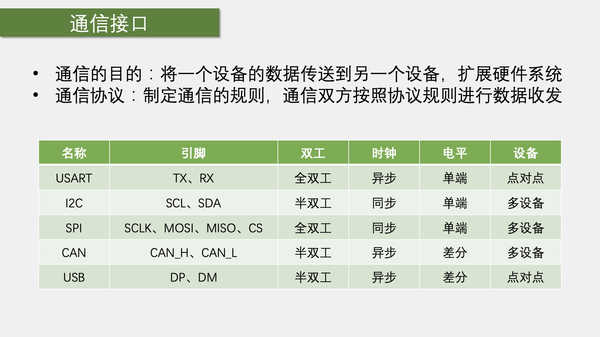

> #### 双工特性
>
> 全双工：通信双方能够同时进行双向通信，一般拥有两条通信线
>
> 半双工：两条通信线合成了一条
>
> 单工：数据只能从一个设备到另一个设备，而不能反着来

> #### 时钟特性
>
> ——指引采样的时钟频率
>
> 同步——拥有时钟信号线，能够子啊对方指引下以某种频率接收信号
>
> 异步——没有时钟信号线，双方需要提前约定，并且还需要加一些帧头帧尾的操作，进行采样位置的对齐

> #### 电平特性
>
> 单端信号：他们引脚的高低电平都是对GND的电压差，所以双方必须要共地，就是把GND接在一起
>
> 差分信号：依靠两个差分引脚的电压差来传输信号的——极大的提高抗干扰特性 

> #### 设备特性
>
> 点对点：两个设备
>
> 多设备：可以在总线上挂载多个设备

## 串口通信

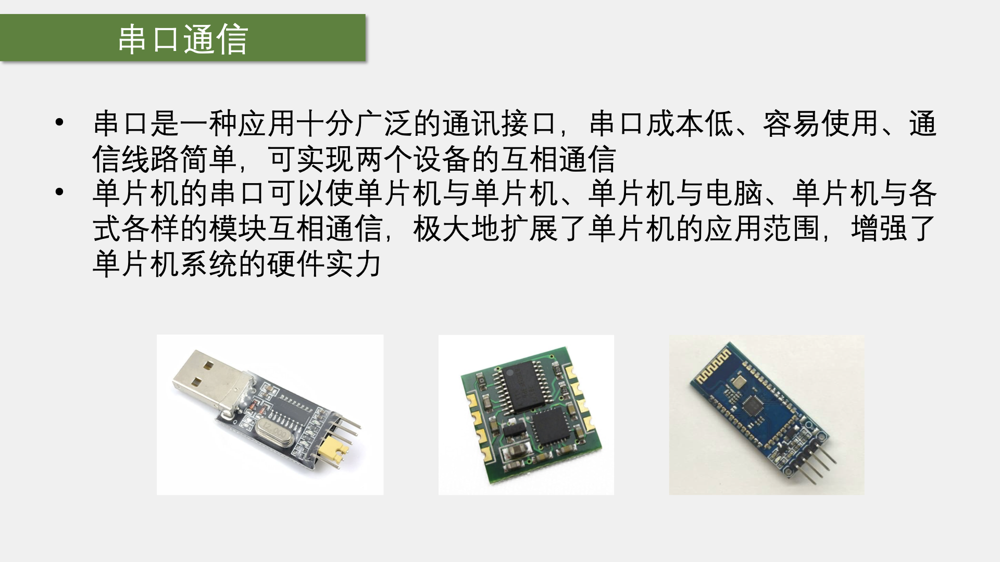

### 硬件电路

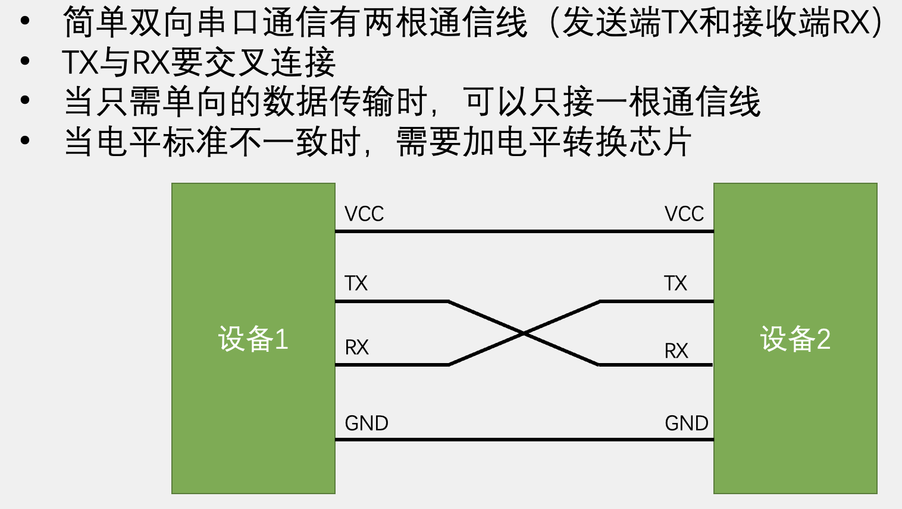

### 电平标准

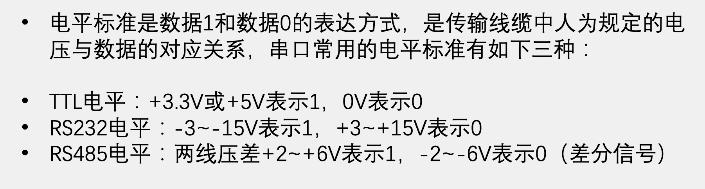

###  串口参数及时序

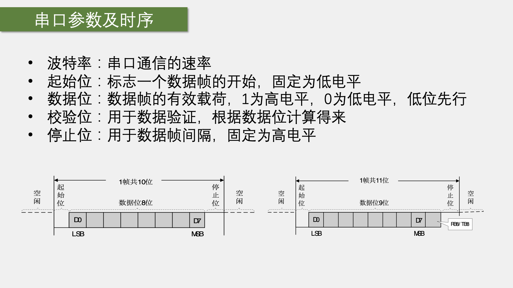

- 一个数据帧里包含起始位、数据位、奇偶分辨位（可选）、停止位
  - 必须要有一个固定位低电位的起始位产生下降沿，来告诉接收设备即将发送数据
  - 同理，也有一个固定为高电平的停止位，用于数据帧间隔。

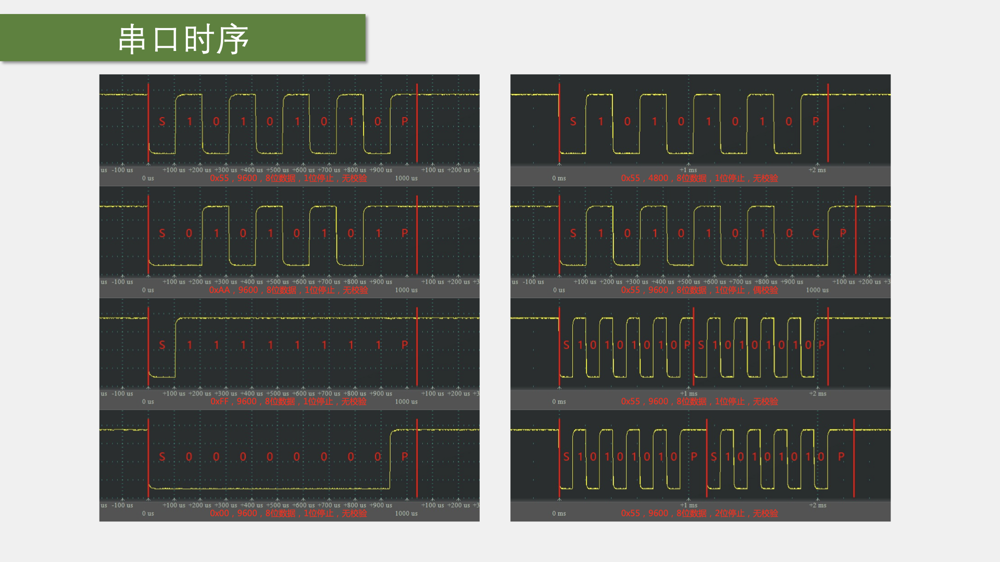

## USART

- USART（Universal Synchronous/Asynchronous Receiver/Transmitter）通用同步/**异步**收发器
- USART是STM32内部集成的硬件外设
  - 可根据数据寄存器的一个字节数据自动生成数据帧时序
    - 从TX引脚发送出去，也可自动接收RX引脚的数据帧时序
    - 之后拼接为一个字节数据，存放在数据寄存器里
- **自带波特率发生器，最高达4.5Mbits/s**
  - 其实就是一个分频器（
- **可配置数据位长度（8/9）、停止位长度（0.5/1/1.5/2）**
- **可选校验位（无校验/奇校验/偶校验）**
- 支持同步模式、硬件流控制、DMA、智能卡、IrDA、LIN

>  STM32F103C8T6 USART资源： USART1（APB1）、 USART2（APB2）、 USART3（APB2）

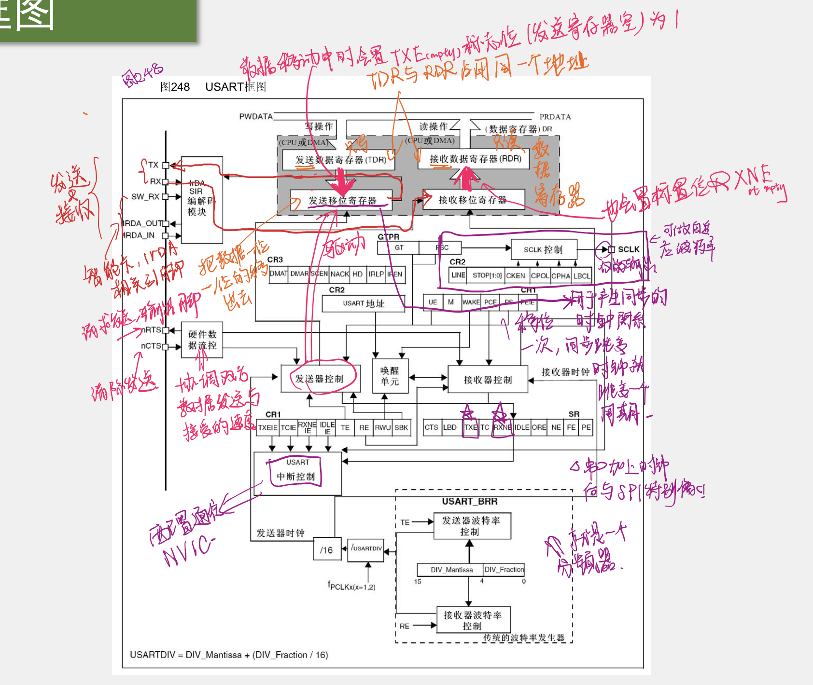

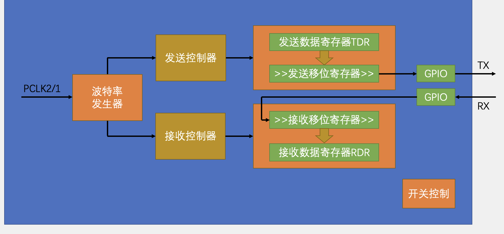

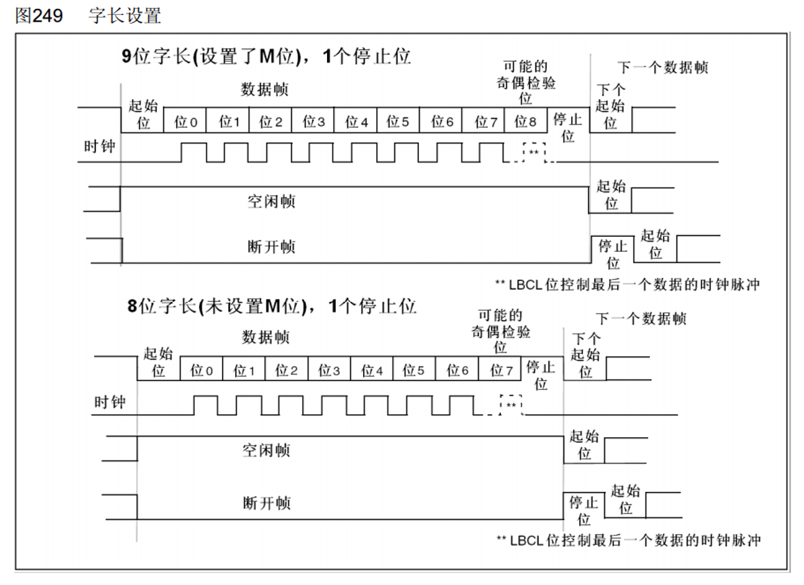

> 空闲/断开帧是局域网用的

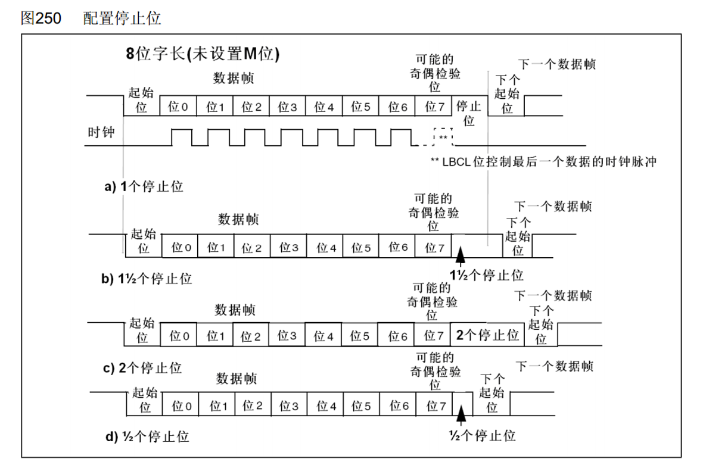

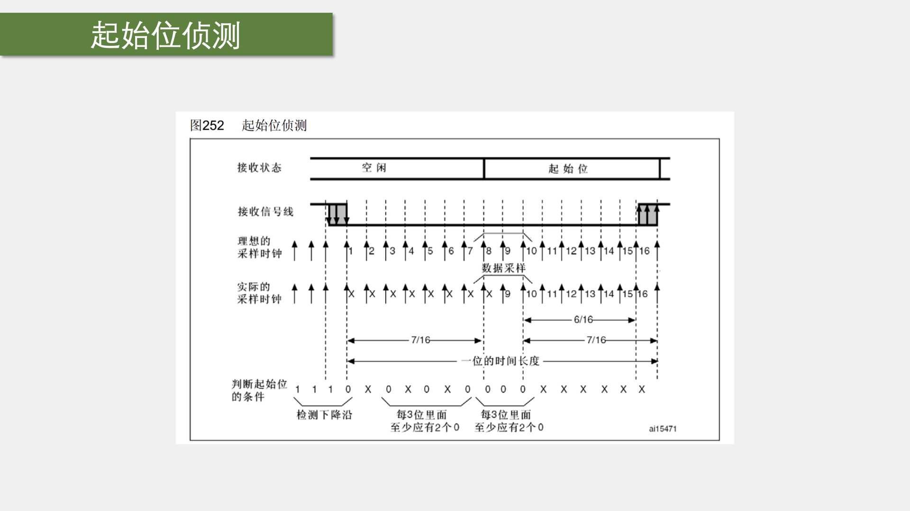

- 会以波特率的16倍进行采样以排除噪声

  > 噪声标识位置：NE

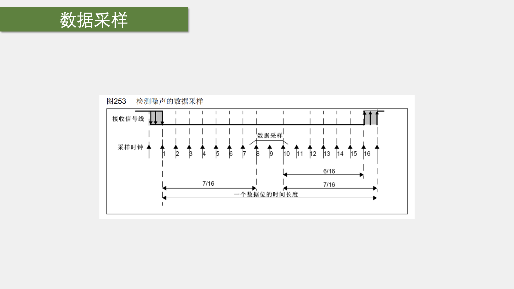

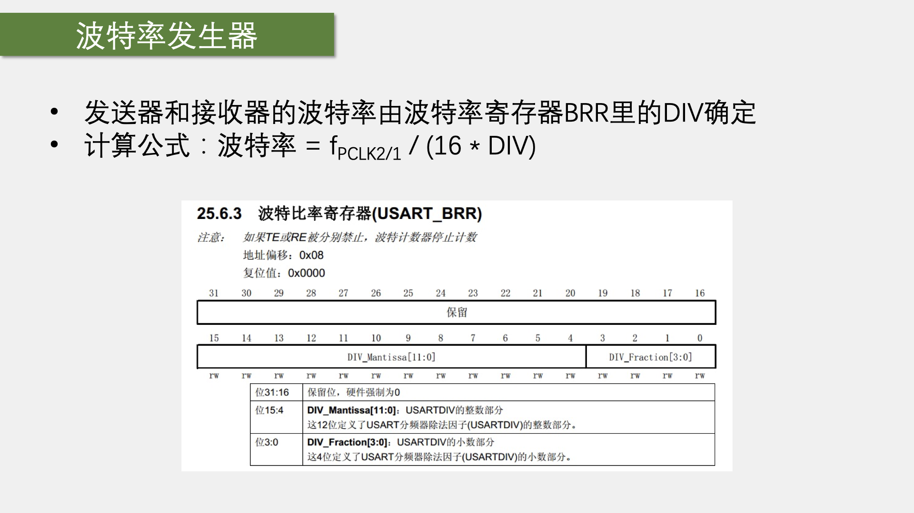

- DIV是一个浮点数，可以得到很细腻的分频
- 这里除以16是因为需要以16倍采样。

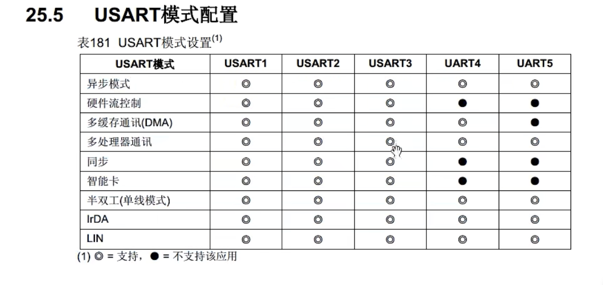

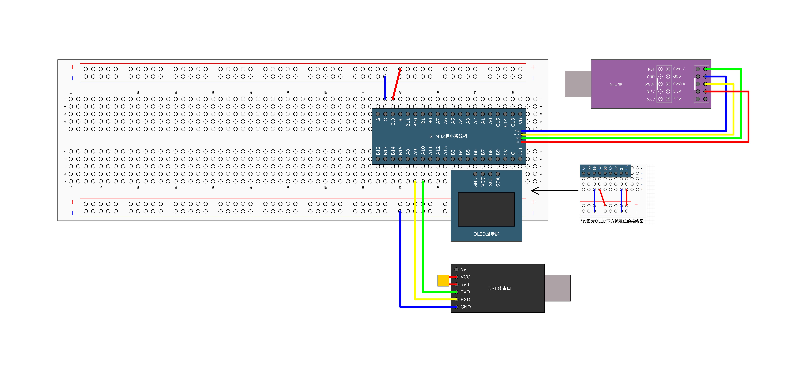

- 检查设备管理器中串口是否能够识别成功，看看能否

- #### 打开USART和GPIO时钟

- #### 初始化GPIO、将TX配置成复用输出，RX配置成浮空/上拉输入

- #### 配置USART

- #### 配置ITConfig和NVIC中断（如果需要接受数据）

- #### 打开USART

这之后，如果要发送数据，调用一个发送函数即可；如果要接受数据，就调用接受的函数；如果获取发送和接受的状态，就调用获取标志位的函数。

- #### 书写发送函数

  - 注意⚠️！调用一次发送函数后，需要书写while死循环判断TXE标识位是否被置1
  - 标志位被置1后不需要手动清0，下次写入TDR时即可自动清0

- #### 发送数据

  - 初始化好对应的GPIO口即可

- #### 接受数据

  - ##### 查询方案

    - **在主函数的while函数中不断判断RXNE标识位置**
      - 如果置1了就说明收到了数据
      - 再调用RecievieData读取DR寄存器 即可

  - ##### 中断方案

    - 配置NVIC

 

## 数据模式

### HEX模式（十六进制模式、二进制模式）

> 以原始数据的形式显示

### 文本模式（字符模式）

> 以原始数据编码后的形式显示

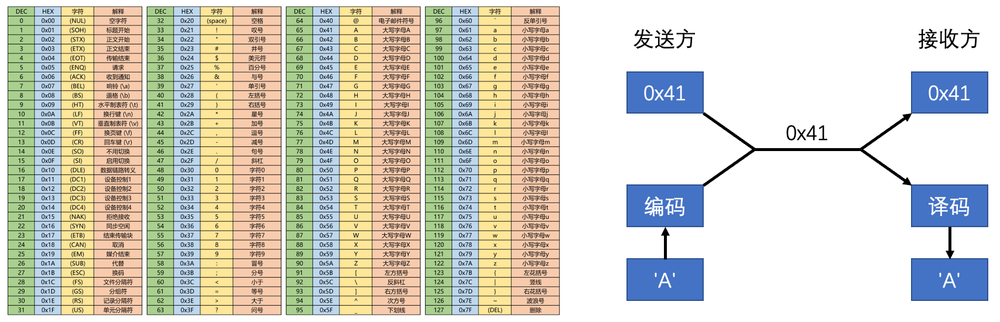

