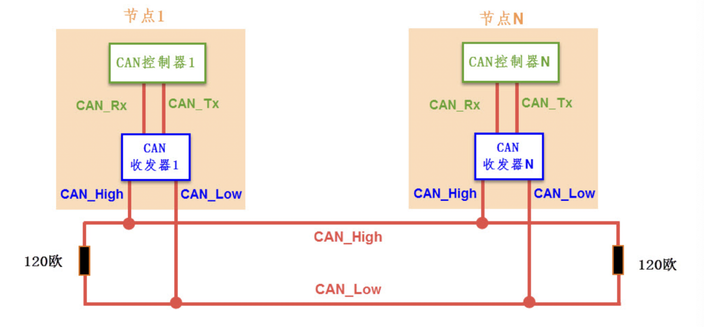
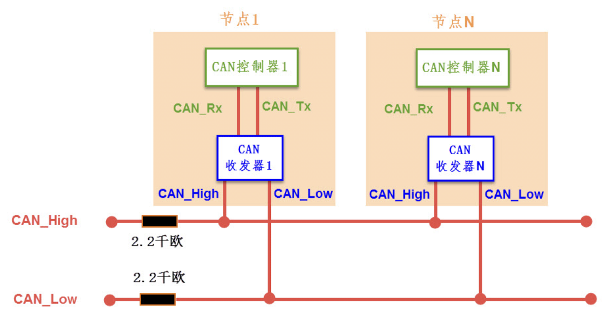
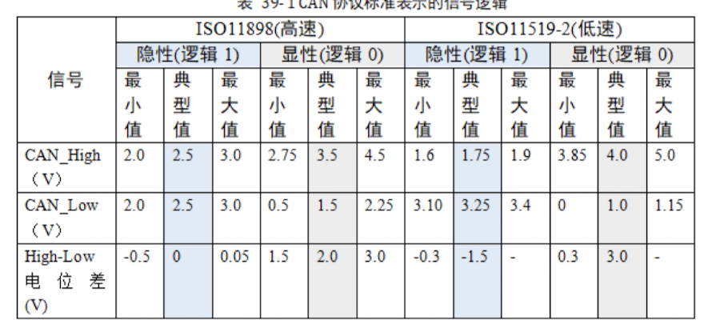
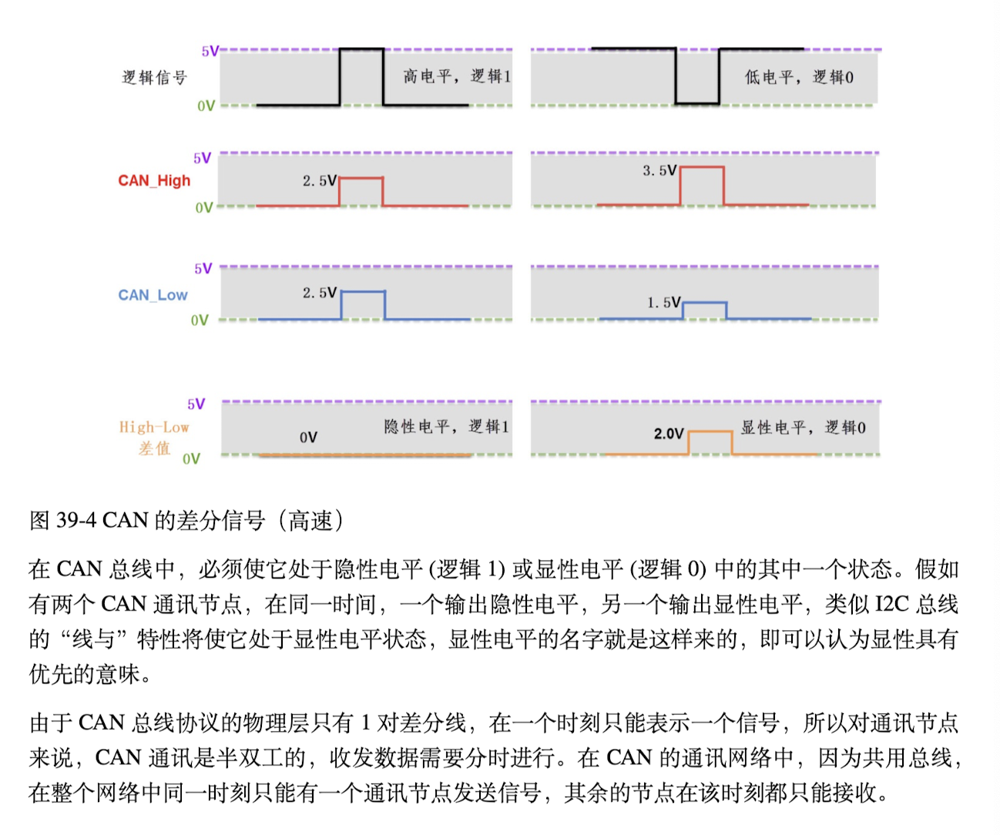
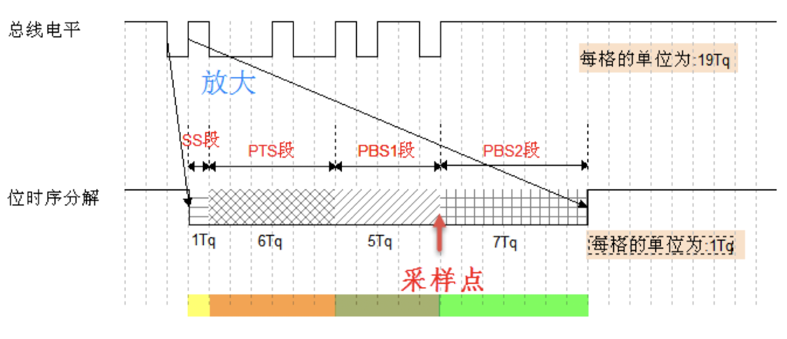

# CAN 通信

## 物理層

- 通過 `CAN_High` 和 `CAN_Low` 两条信号线，共同构成一组**差分信号线**，以差分信号的形式进行通讯。

### 總線網絡

#### 閉環

- ISO 11898 標準 
- 高速、短距離

#### 開環

- ISO 11519-2
- 低速、遠距離

### 通訊結點

- CAN 總線上可以掛載多個通訊結點，結點間的信號經過總線傳輸，實現了結點間通訊。
  - CAN通訊協議**不對結點進行地址編碼**，而是**對數據內容進行編碼**
- CAN通信結點由一個CAN控制器以及CAN收發器組成
  - 控制器與收發器之間通過CAN_Tx以及CAN_Rx信號線相連
    - 類似於普通的TTL邏輯信號
  - 收发器与CAN 总线之间使用CAN_High 及CAN_Low 信号线相连
    - 是一對**差分信號**

> 「日出換日落 青春換成就」

- MCU連結到CAN控制器，輸出普通邏輯信號到CAN收發器，經過收發器轉換為差分信號，傳遞到CAN總線。

## 差分信號

- 差分信號又稱作差模信號，於傳統使用單跟信號線點呀表示邏輯的方式有區別。     

- #### 若干優點

  - 抗干擾能力強
  - 能有效抑制它對外部的電磁干擾
  - 時許定位精確

### CAN協議中的差分信號

#### 

## 協議層

### 波特率&位同步

- CAN通信屬於異步通訊，沒有時間信號線
  - 連結在同一個總線網絡的各個結點會向串口異步通訊那樣，結點間使用約定好的波特率進行通訊，特別地，CAN還會使用“位同步”的方式來抗干擾，吸收誤差，實現對總線電平信號進行正確的採樣，確保通訊正常

### 位時序分解

- CAN協議將每一個數據位的時許分解位

  - SS段

    - 同步段

      > 若通讯节点检测到总线上信号的跳变沿被包含在SS 段的范围之内，
      > 则表示节点与总线的时序是同步的，当节点与总线同步时，采样点采集到的总线电平
      > 即可被确定为该位的电平。SS 段的大小固定为1Tq。

  - PTS段

    - 傳播時間段

      > 這個時間段是用於補償網絡的物理延時時間，時總線上屬土比較延時和輸出驅動器延時總和的兩倍

  - PBS1段
    - 相位緩衝段1

  - PBS2段
    - 相位緩衝段2

- **分解後最小的時間單位是 Tq**

> 该图中表示的CAN 通讯信号每一个数据位的长度为19Tq，其中SS 段占1Tq，PTS 段占6Tq，PBS1段占5Tq，PBS2 段占7Tq。信号的采样点位于PBS1 段与PBS2 段之间，通过控制各段的长度，可以對採樣點的位置進行偏移，以便準確地採樣。

### 通訊的波特率

