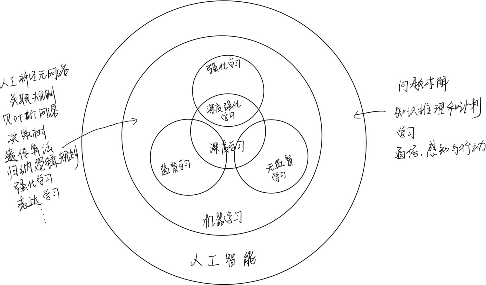

# 打开机器的脑袋

> 2022090909003 李晨熙

## 对 AI、ML、DL 的理解

### 人工智能

- AI（人工智能）是一项涉及模拟人类智能的技术。它致力于使计算机系统能够执行复杂任务，这些任务通常需要人类的思考和决策能力。AI可以被分为弱人工智能和强人工智能两种类型。弱人工智能是指具有特定功能的AI系统，例如语音助手、聊天机器人以及图像识别软件等。这些系统在特定领域中表现出色，但在其他任务上则可能无能为力。强人工智能则是目前仍在研究中的理论，指的是具有与人类相当或超过人类的智能。

  AI的核心技术包括机器学习、深度学习和自然语言处理等。机器学习是一种让计算机从经验数据中学习的方法，而深度学习则是机器学习的一种形式，模仿了人脑神经网络的结构和功能。自然语言处理使计算机能够理解和处理自然语言，如文本和语音。

  AI在许多领域都有广泛的应用，例如医疗诊断、金融分析、交通规划和自动驾驶等。AI还在改变我们的日常生活，例如智能家居、语音助手和推荐系统等。虽然AI在许多方面都取得了巨大的进展，但它仍然面临许多挑战，如数据隐私、伦理问题和可解释性的缺乏。

  AI是一项迅速发展的领域，将对人类社会产生深远影响。它有巨大的潜力，但也需要我们谨慎应对，确保其发展符合伦理和社会价值观。

### 机器学习

- 机器学习是一种人工智能领域的技术，旨在使计算机系统能够自动学习和改进，而无需进行明确的编程。它是通过分析和解释大量数据，并从中提取模式和规律，使计算机能够做出预测或采取行动。

  在机器学习中，我们向计算机系统输入大量的训练数据，并告诉计算机系统应该如何处理这些数据。通过使用不同的算法和模型，机器学习系统可以发现数据中的模式和特征，并根据这些模式和特征作出判断和预测。

  机器学习可以分为监督学习、无监督学习和强化学习三种主要类型。

  - 在监督学习中，我们向机器学习系统提供带有标签的训练数据，告诉计算机什么是正确的输出。系统会通过分析数据中的模式和特征来建立一个预测模型，并用于对新的未标记数据进行预测。
  - 无监督学习是指在没有标签的情况下让机器学习系统从数据中挖掘出隐藏的模式或结构。系统会自行寻找数据中的相似性和关联性，并生成一些有用的信息。
  - 强化学习是通过给予机器学习系统奖励或惩罚的反馈来教授它如何采取正确的行动。系统会根据反馈来调整自己的行为，以最大化预期的奖励。

  机器学习在许多领域中都有广泛的应用，如图像识别、语音识别、自然语言处理、推荐系统等。它是实现人工智能的关键技术之一，对于处理大规模数据和解决复杂问题具有重要意义。

### 深度学习

- 机器学习和深度学习是密切相关的概念，深度学习是机器学习的一个子领域。

  机器学习是一种通过从数据中学习来解决问题的方法。它关注于开发能够自动从经验中改进的算法，并使用这些算法对新数据进行预测或决策。机器学习包括许多不同的技术和方法，例如监督学习、无监督学习和强化学习。

  深度学习是机器学习的一个分支，它利用人工神经网络（ANN）来模拟和学习类似于人脑神经元之间相互连接的方式。深度学习主要关注于处理和学习大规模数据集，其核心思想是通过多层次的神经网络来提取高级抽象特征，并使用这些特征来进行分类、回归等任务。

#### 关系图

## 对 嵌入式 和 嵌入式AI 的理解

> [稚晖君：嵌入式AI入坑经历](https://zhuanlan.zhihu.com/p/115598733)

### 嵌入式

嵌入式系统是一种特殊类型的计算机系统，它被设计用于执行特定的功能或任务，并且通常被包含在其他设备或系统中。嵌入式系统通常具有以下几个特点：

1. 特定功能：嵌入式系统旨在执行特定的功能或任务，例如控制、监测、通信等。它们通常专注于一个或一组紧密相关的任务，而不是提供通用计算能力。

2. 实时操作：许多嵌入式系统需要实时响应，即在规定的时间限制内对输入做出及时的反应。这是因为许多嵌入式系统用于控制和监测，需要在严格的时间约束下进行操作。

3. 低功耗和资源限制：由于嵌入式系统通常作为其他设备的一部分运行，资源（如处理器、内存和存储）和功耗方面往往受到限制。嵌入式系统需要在有限的资源和功耗条件下高效地运行。

4. 实时约束：嵌入式系统通常需要对外部环境进行感知并做出适时的反应。例如，传感器数据的快速响应和精确度可能是关键要求。

5. 可靠性和安全性：嵌入式系统通常在核心系统或关键任务中使用，并且需要具备高度的可靠性和安全性。这是为了确保系统在各种环境下的正常工作以及防止潜在的威胁。

嵌入式系统广泛应用于各个领域，如消费电子产品、医疗设备、交通运输、工业自动化、智能家居等。选择合适的处理器、编程语言和开发工具等都是在开发嵌入式系统时需要考虑的因素。

在嵌入式开发过程中，主要分为硬件和软件两个方面。硬件开发主要涉及选择和设计适合嵌入式系统的硬件平台，包括处理器、存储器、传感器、执行器等。硬件开发者需要根据项目需求选择合适的硬件组件，并进行电路设计、原理图设计、PCB布局等工作。他们还需要进行硬件调试和验证，确保硬件可以正常工作并与软件正确交互。软件开发则涉及嵌入式系统的应用程序开发、驱动程序开发、操作系统移植或定制等。软件开发者需要了解嵌入式系统架构和硬件平台的特性，并使用合适的编程语言和开发工具来实现所需功能。他们也需要进行调试和测试，确保软件在嵌入式系统上正确运行。

硬件和软件开发之间有密切的协作关系。硬件开发者提供硬件平台和接口规范，使得软件能够在特定的硬件上运行。同时，软件开发者需要了解硬件特性和限制，以便优化软件的性能和可靠性。

在嵌入式开发过程中，硬件和软件开发者通常需要进行交互和合作，以确保最终嵌入式系统的设计和开发能够达到预期的功能和性能要求。

嵌入式系统有很多前沿应用：

1. 物联网（Internet of Things, IoT）：嵌入式系统在物联网中扮演着重要角色。通过将传感器、执行器和通信技术集成在一起，嵌入式系统能够实现对各种设备和环境的监测、控制和连接，从而实现智能化和自动化。

2. 人工智能（Artificial Intelligence, AI）：嵌入式系统与人工智能的结合，使得设备能够具备感知、理解和决策的能力。例如，在智能手机上的语音助手、智能家居中的智能音箱等都是嵌入式系统与人工智能相结合的典型应用。

3. 自动驾驶技术：嵌入式系统在自动驾驶领域发挥着重要作用。通过利用各种传感器和算法，嵌入式系统能够感知车辆周围的环境，并做出相应的决策和控制，实现自动驾驶功能。

4. 医疗设备：嵌入式系统在医疗设备中被广泛使用。例如，可植入式心脏起搏器、健康监测设备、医疗图像处理系统等都是嵌入式系统在医疗领域的应用。

5. 智能城市：嵌入式系统可以应用于智能交通、智能安防、智能能源管理等方面，实现城市的智能化和高效运营。

6. 无人机和机器人技术：嵌入式系统为无人机和机器人提供了控制和感知能力，使其能够在各种环境中自主地执行任务。

### 嵌入式AI

嵌入式AI，又称为EAI（Embedded Artificial Intelligence，嵌入式人工智能），是一个内置在网络设备中的AI功能通用框架系统，为网络设备上基于AI算法的功能提供公共的模型管理、数据获取和预处理功能，并且支持将推理结果发送给基于AI算法的功能。不仅能够充分利用设备的样本数据和计算能力，而且具有降低数据传送成本、保证数据安全以及保证推理决策的实时性等优点。

以人工智能为代表的第四次工业革命已经来临，AI正在以前所未有的速度深刻改变人类社会生活，改变世界。AI技术可以在参数调优、应用识别、安全、故障诊断等多个方面为网络设备创造价值。

AI的三个核心要素是：算法、算力和数据，如果设备上支持的AI功能都单独维护一套算法、算力和数据，基于智能算法的功能要求设备提供海量的样本数据和高性能的计算能力，将严重影响设备的正常运行。

嵌入式AI系统提供了一个完整的AI功能通用框架系统，AI功能可以订阅嵌入式AI系统的服务。订阅后，嵌入式AI系统会基于智能算法对该AI功能相关的实时数据进行推理，AI功能根据推理结果可以指导功能实现。在数据产生的本地进行分析和推理，具有降低数据传送成本、保证数据安全以及保证推理决策的实时性等优点。

嵌入式Ai有许多发展方向：

1. 边缘计算：边缘计算是指在离数据产生源头近的地方进行数据处理和分析，以减少数据传输和延迟。嵌入式AI可以在边缘设备上进行实时的智能决策和反馈，提高响应速度和隐私保护。

2. 深度学习芯片：为了应对复杂的模型训练和推理任务，嵌入式AI需要更高性能和能效的硬件支持。因此，研发面向嵌入式场景的低功耗、高计算能力的深度学习芯片是一个重要的方向。

3. 算法优化：嵌入式设备通常资源有限，因此针对嵌入式AI的算法优化是必要的。压缩、量化网络模型，设计高效的特征提取和推理算法，以及设计适应不同嵌入式平台的部署策略等，都是算法优化的关键方向。

4. 联合学习和边缘协同：联合学习是指多个设备协作进行模型训练，而边缘协同是指在边缘设备之间共享模型和推理结果，以实现更高效的模型更新和推理。这些技术可以减少数据传输和计算负载，提升嵌入式AI系统的性能和效率。

5. 应用场景拓展：嵌入式AI在智能家居、智能交通、工业自动化等领域有广泛应用。未来的发展方向包括将嵌入式AI应用于医疗健康、农业、物联网和机器人等更多领域，为人们的日常生活和工作带来更多智能化的便利。

## 我感兴趣的方向——边缘计算

我对边缘计算比较感兴趣。我一直羡慕敬佩的学长稚晖君曾在华为从事**昇腾AI边缘计算专家**的工作。边缘计算着重要解决的问题，是传统云计算（或者说是中央计算）模式下存在的高延迟、网络不稳定和低带宽问题。

当我们谈论边缘计算时，通常是指在离数据产生源头近的地方进行数据处理和分析，而不是将所有数据传输到云端进行处理。这种方式可以减少数据传输的延迟和带宽需求，并提高响应速度和隐私保护。

边缘计算有以下几个关键概念：

1. 边缘设备：边缘设备是嵌入式系统中的计算设备，通常位于数据产生源头附近。例如，智能手机、传感器节点、工业控制器等都可以作为边缘设备。

2. 边缘网关：边缘网关是连接边缘设备和云端服务器之间的中间设备。它可以进行数据的过滤、汇聚和预处理，以及决策的执行。边缘网关起着连接边缘设备和云端服务器的桥梁作用。

3. 边缘服务：边缘服务是运行在边缘设备或边缘网关上的软件或功能模块。它们可以提供实时的数据分析、智能决策和反馈，以满足特定的业务需求。

边缘计算的优势包括：

- 低延迟：由于数据的处理和分析发生在离数据源近的地方，边缘计算可以减少传输延迟。这对于实时应用场景（如自动驾驶、智能家居等）至关重要。

- 带宽节省：边缘计算可以在边缘设备上进行数据过滤和汇聚，只将需要的摘要或结果传输到云端服务器。这样可以节省带宽，并降低数据传输成本。

- 隐私保护：边缘计算可以在边缘设备上执行敏感数据的处理和分析，而不必将其传输到云端。这样可以更好地保护用户的隐私和数据安全。

边缘计算在许多领域都有广泛应用，包括智能交通、工业自动化、物联网、智能家居等。它使得嵌入式设备能够具备更高级别的智能决策和反馈能力，同时提供更加高效和可靠的服务。随着边缘计算技术的发展和硬件的进步，边缘计算在未来会继续发挥重要作用。

在未来的四轴飞行器课程中，我希望将机器学习算法实现的实时检测和补偿大幅晃动来提高飞行的稳定性的方案部署在无人机上。晃动和震动是四轴无人机飞行过程中常见的问题，可能会对飞行稳定性和图像/视频质量产生负面影响。传统方法通常使用陀螺仪和加速度计等传感器来获取姿态数据，然后通过PID控制器进行反馈控制以维持平稳的飞行。虽然这些方法可以在一定程度上解决问题，但对于大幅晃动和震动情况，效果可能有限。
